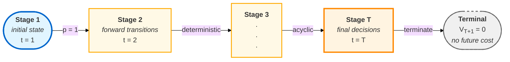
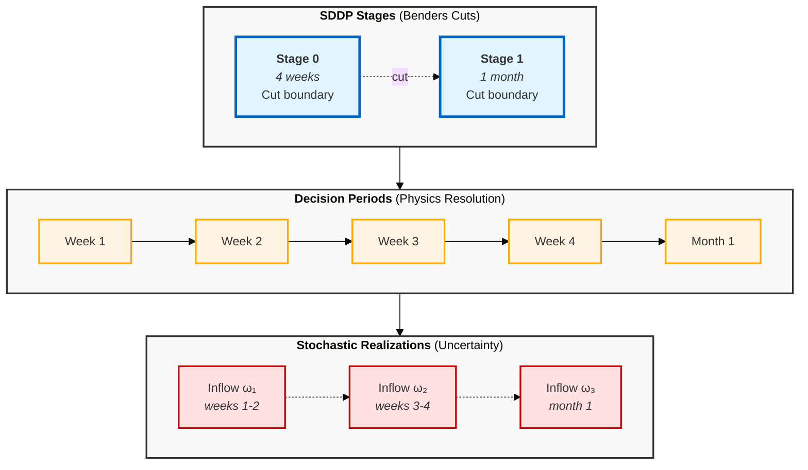

# POWE.RS Mathematical Formulations

> **Document Purpose**: Complete mathematical specification of the SDDP algorithm, LP subproblem formulation, stochastic modeling, and convergence analysis for the POWE.RS hydrothermal dispatch solver.
>
> **Notation Convention**: Follows [SDDP.jl](https://sddp.dev/stable/) canonical notation.
>
> **Last Updated**: 2026-01-22

---

## Table of Contents

### Part I: SDDP Algorithm Foundation

1. [Introduction](#1-introduction)
2. [SDDP Algorithm Overview](#2-sddp-algorithm-overview)

### Part II: Stage Subproblem Formulation

3. [Notation and Sets](#3-notation-and-sets)
4. [Base LP Formulation](#4-base-lp-formulation)
5. [Block Formulation Variants](#5-block-formulation-variants)
6. [Hydro Production Function Models](#6-hydro-production-function-models)
7. [Equipment-Specific Formulations](#7-equipment-specific-formulations)

### Part III: Stochastic Modeling

8. [PAR(p) Inflow Model](#8-parp-inflow-model)
9. [Inflow Non-Negativity Methods](#9-inflow-non-negativity-methods)

### Part IV: Cut Management and Convergence

10. [Cut Generation and Aggregation](#10-cut-generation-and-aggregation)
11. [Cut Selection Strategies](#11-cut-selection-strategies)
12. [Stopping Rules](#12-stopping-rules)

### Part V: Advanced Formulations

13. [Discount Rate](#13-discount-rate)
14. [Infinite Periodic Horizon](#14-infinite-periodic-horizon)
15. [Upper Bound Evaluation (Inner Approximation)](#15-upper-bound-evaluation-inner-approximation)
16. [Risk-Averse SDDP (CVaR)](#16-risk-averse-sddp-cvar)

### Part VI: Configuration Reference

17. [Configuration-Driven LP Variants](#17-configuration-driven-lp-variants)
18. [Cross-Reference to Data Model](#18-cross-reference-to-data-model)

### Appendices

- [Appendix A: Notation Reference](#appendix-a-notation-reference)
- [Appendix B: SDDP Algorithm Pseudocode](#appendix-b-sddp-algorithm-pseudocode)
- [Appendix C: Deferred Features](#appendix-c-deferred-features)

---

# Part I: SDDP Algorithm Foundation

---

## 1. Introduction

### 1.1 Document Purpose

This document provides the complete mathematical specification for the POWE.RS Stochastic Dual Dynamic Programming (SDDP) solver. It serves as the authoritative reference for:

- **Algorithm specification**: The SDDP iterative process, including forward and backward passes
- **LP formulation**: The stage subproblem structure, decision variables, constraints, and objective
- **Stochastic modeling**: Inflow models, scenario trees, and uncertainty handling
- **Convergence analysis**: Stopping rules, bound computation, and gap analysis
- **Extensions**: Risk measures, infinite horizon, and advanced features

For data structures, file formats, and implementation details, see [DATA_MODEL_SPECIFICATION.md](./DATA_MODEL_SPECIFICATION.md).

### 1.2 Notation Conventions

This document follows [SDDP.jl](https://sddp.dev/stable/) notation conventions for consistency with the broader SDDP literature:

| Convention | Meaning |
|------------|---------|
| $t \in \{1, \ldots, T\}$ | Stage index |
| $\omega \in \Omega_t$ | Scenario realization at stage $t$ |
| $x_t$ | State variables at end of stage $t$ |
| $\hat{x}_{t-1}$ | Incoming state (from previous stage) |
| $V_t(x)$ | Value function (cost-to-go) at stage $t$ |
| $\theta_t$ | Epigraph variable approximating $V_{t+1}$ |
| $\pi$ | Dual variables (Lagrange multipliers) |
| $(\alpha, \beta)$ | Cut intercept and coefficients |

### 1.3 Problem Context

POWE.RS solves the **hydrothermal dispatch problem**: determining optimal generation schedules for hydro and thermal plants over a multi-year planning horizon under inflow uncertainty. Key characteristics:

- **Long horizons**: 5-10 years (60-120 monthly stages)
- **Large state space**: 160+ hydro reservoirs with AR inflow models
- **Stochastic inflows**: PAR(p) autoregressive models with seasonal patterns
- **Coupling constraints**: Cascade hydrology, transmission limits, energy balance

---

## 2. SDDP Algorithm Overview

### 2.1 Multistage Stochastic Programming Formulation

The hydrothermal dispatch problem is formulated as a multistage stochastic program:

$$
\min_{x_1, \ldots, x_T} \mathbb{E}\left[ \sum_{t=1}^{T} c_t(\omega_t)^\top x_t(\omega_{[t]}) \right]
$$

subject to stage-linking constraints and uncertainty realization. The nested formulation uses **value functions**:

$$
V_t(x_{t-1}) = \mathbb{E}_{\omega_t}\left[ \min_{x_t} \left\{ c_t^\top x_t + V_{t+1}(x_t) : A_t x_t = b_t - E_t x_{t-1}, \; x_t \in \mathcal{X}_t \right\} \right]
$$

with terminal condition $V_{T+1}(x) = 0$.

**Key insight**: The value function $V_t(x)$ is convex and piecewise linear (for LP subproblems), enabling outer approximation via Benders cuts.

### 2.2 The SDDP Algorithm

SDDP iteratively builds piecewise-linear approximations $\hat{V}_t^k$ of the true value functions through:

1. **Forward pass**: Sample scenarios, make decisions using current approximation
2. **Backward pass**: Compute cuts to improve the approximation
3. **Convergence check**: Evaluate stopping criteria

#### 2.2.1 Forward Pass

The forward pass simulates the system under the current policy to generate **trial points** (visited states):

**Algorithm: Forward Pass** (iteration $k$, pass $m$)

- **Input:** Initial state $x_0$, cut approximations $\{\hat{V}_t^k\}$
- **Output:** Visited states $\{\hat{x}_t^m\}_{t=1}^T$, scenario costs

1. Set $\hat{x}_0 = x_0$
2. For $t = 1$ to $T$:
   - Sample $\omega_t \sim P(\Omega_t)$
   - Solve stage LP with incoming state $\hat{x}_{t-1}$ and realization $\omega_t$:
     $$\hat{x}_t, \hat{\theta}_t = \arg\min \{ c_t^\top x_t + \theta_t : \text{constraints}(x_t, \hat{x}_{t-1}, \omega_t), \theta_t \geq \alpha_i + \beta_i^\top x_t \; \forall \text{ cut } i \}$$
   - Record visited state $\hat{x}_t$
3. Return $\{\hat{x}_t^m\}_{t=1}^T$

**Parallelization**: Forward passes are embarrassingly parallel—each scenario trajectory is independent. POWE.RS distributes $M$ forward passes across MPI ranks.

#### 2.2.2 Backward Pass

The backward pass computes cuts by walking stages in reverse order:

**Algorithm: Backward Pass** (iteration $k$)

- **Input:** Visited states from forward passes
- **Output:** New cuts for each stage

1. For $t = T$ down to $1$:
   - For each visited state $\hat{x}_{t-1}$ from forward passes:
     - For each $\omega \in \Omega_t$ (branching scenarios):
       - Solve stage LP with $(\hat{x}_{t-1}, \omega)$
       - Extract: $Q_t(\hat{x}_{t-1}, \omega) = \text{optimal value}$  
         $\pi_t(\omega) = \text{dual of state constraints}$
       - Compute per-scenario cut coefficients (see Section 3.4 for sign convention):  
         $\beta(\omega) = \pi_t(\omega)$ (for state constraints $x_t = \hat{x}_{t-1} + \ldots$)  
         $\alpha(\omega) = Q_t - \beta(\omega)^\top \hat{x}_{t-1}$
     - Aggregate cut (single-cut formulation):  
       $\bar{\beta} = \sum_\omega p(\omega) \cdot \beta(\omega)$  
       $\bar{\alpha} = \sum_\omega p(\omega) \cdot \alpha(\omega)$
     - Add cut to stage $t-1$:  
       $\theta_{t-1} \geq \bar{\alpha} + \bar{\beta}^\top x_{t-1}$

**Warm-starting**: The forward pass solution provides a near-optimal basis for backward branching scenarios, significantly reducing solve times.

#### 2.2.3 Convergence Monitoring

**Lower Bound**: The deterministic lower bound is the first-stage LP value:

$$
\underline{z}^k = V_1^k(x_0) = \min_{x_1} \left\{ c_1^\top x_1 + \theta_1 : \text{constraints}, \; \theta_1 \geq \alpha_i + \beta_i^\top x_1 \; \forall i \right\}
$$

This bound increases monotonically as cuts are added.

**Upper Bound**: Estimated via Monte Carlo simulation or inner approximation (see Section 15):

$$
\bar{z}^k = \frac{1}{M} \sum_{m=1}^{M} \sum_{t=1}^{T} c_t^\top x_t^{(m)}
$$

**Optimality Gap**:

$$
\text{gap}^k = \frac{\bar{z}^k - \underline{z}^k}{\max(1, |\bar{z}^k|)}
$$

### 2.3 Policy Graph Structure

#### 2.3.1 Finite Horizon (Acyclic Graph)

The standard SDDP formulation uses an acyclic directed graph:



- **Nodes**: Stages $t \in \{1, \ldots, T\}$
- **Arcs**: Transitions with probabilities (typically deterministic: $p = 1$)
- **Terminal**: $V_{T+1}(x) = 0$ (no future cost)

#### 2.3.2 Cyclic Graph (Infinite Horizon)

For long-term planning, POWE.RS supports **infinite periodic horizon** with cyclic graphs:

```mermaid
%%{init: {'theme':'base', 'themeVariables': {'fontSize':'16px', 'fontFamily':'Arial'}}}%%
graph LR
    S1(["<b>Stage 1</b><br/><i>initial stages</i><br/>acyclic portion"])
    S2["<b>Stage 2</b>"]
    S3["<b>...</b>"]
    S_c(["<b>Stage c</b><br/><i>cycle start</i><br/>e.g., month 1"])
    S_mid["<b>Stage c+1</b><br/><i>month 2</i>"]
    S_dots["<b>...</b>"]
    S_T["<b>Stage T</b><br/><i>final month in cycle</i><br/>e.g., month 12"]
    
    S1 -->|"serial path"| S2
    S2 --> S3
    S3 -->|"reaches cycle"| S_c
    S_c --> S_mid
    S_mid --> S_dots
    S_dots --> S_T
    S_T -.->|"<b>cycle with discount β < 1</b><br/><i>infinite horizon loop</i>"| S_c
    
    style S1 fill:#e1f5ff,stroke:#0066cc,stroke-width:3px
    style S2 fill:#e8f5ff,stroke:#0088cc,stroke-width:2px
    style S3 fill:#e8f5ff,stroke:#0088cc,stroke-width:2px
    style S_c fill:#fff4e1,stroke:#ff8800,stroke-width:3px
    style S_mid fill:#fff9e6,stroke:#ffaa00,stroke-width:2px
    style S_dots fill:#fff9e6,stroke:#ffaa00,stroke-width:2px
    style S_T fill:#ffe1e1,stroke:#cc0000,stroke-width:3px
    linkStyle 6 stroke:#cc0000,stroke-width:3px,stroke-dasharray: 5 5
```



- **Cycle**: Stage $T$ transitions back to stage $1$ (or a cycle start)
- **Discount**: Cycle transitions require discount rate $\beta < 1$ for convergence
- **Cut sharing**: Cuts at equivalent cycle positions are shared

See Section 14 for the complete infinite horizon formulation.

### 2.4 State Variables and the Markov Property

For SDDP to generate valid cuts, the subproblem must satisfy the **Markov property**: future costs depend only on the current state, not on how we arrived at that state.

**State variables in POWE.RS**:

| Component | Variable | Count | Description |
|-----------|----------|-------|-------------|
| Hydro storage | $v_h$ | $N_{hydro}$ | Reservoir volume at end of stage |
| AR inflow lags | $a_{h,\ell}$ | $\sum_h P_h$ | Lagged inflows for AR(P) models |
| Battery SOC | $soc_{bat}$ | $N_{battery}$ | Battery state of charge (DEFERRED) |
| GNL pipeline | $gnl_{t,\ell}$ | $\sum_{gnl} L_{gnl}$ | Committed GNL dispatch (DEFERRED) |

**State expansion trick**: The AR inflow model requires past inflows $a_{h,t-1}, a_{h,t-2}, \ldots$ to compute current inflow. To maintain the Markov property, these lags are included as state variables with trivial dynamics:

$$
a_{h,\ell}^{out} = a_{h,\ell-1}^{in} \quad \text{for } \ell = 2, \ldots, P_h
$$

This allows cut coefficients to capture the value of inflow history.

### 2.5 Single-Cut vs Multi-Cut Formulation

**Single-Cut (Default)**: One aggregated cut per iteration:

$$
\theta_{t-1} \geq \bar{\alpha} + \bar{\beta}^\top x_{t-1}
$$

where $\bar{\alpha} = \mathbb{E}[\alpha(\omega)]$ and $\bar{\beta} = \mathbb{E}[\beta(\omega)]$.

- **Pros**: Fewer cuts, smaller LP, faster solves
- **Cons**: May require more iterations to converge

**Multi-Cut (DEFERRED)**: One cut per scenario per iteration:

$$
\theta_{t-1,\omega} \geq \alpha(\omega) + \beta(\omega)^\top x_{t-1} \quad \forall \omega \in \Omega_t
$$

- **Pros**: Tighter approximation, fewer iterations
- **Cons**: More cuts, larger LP, memory-intensive

POWE.RS implements single-cut by default. Multi-cut is planned for future implementation.

---

# Part II: Stage Subproblem Formulation

---

## 3. Notation and Sets

### 3.1 Index Sets

| Symbol | Description | Typical Size | Notes |
|--------|-------------|--------------|-------|
| $t \in \{1, \ldots, T\}$ | Stages | 60-120 | 5-10 year monthly horizon |
| $k \in \mathcal{K}$ | Blocks within stage | 1-24 | 3 typical (LEVE/MÉDIA/PESADA) |
| $\mathcal{B}$ | Buses | 4-10 | 4-5 for SIN subsystems |
| $\mathcal{H}$ | Hydro plants | 160 | All plants in system |
| $\mathcal{H}^{op} \subseteq \mathcal{H}$ | Operating hydros (can generate) | $\approx |\mathcal{H}|$ | Most/all plants typically operating |
| $\mathcal{H}^{fill} \subseteq \mathcal{H}$ | Filling hydros (no generation) | 0 | Usually 0; rare for new plants under commissioning |
| $\mathcal{T}$ | Thermal plants | 130 | |
| $\mathcal{L}$ | Transmission lines | 10 | Regional interconnections |
| $\mathcal{C}^{imp}$, $\mathcal{C}^{exp}$ | Import/export contracts | 5 | |
| $\mathcal{P}$ | Pumping stations | 5 | |
| $\mathcal{G}$ | Generic constraints | 50 | User-defined |
| $\mathcal{S}_b$ | Deficit segments for bus $b$ | 1 | Multiple segments optional |
| $\mathcal{M}_h$ | FPHA planes for hydro $h$ | 125 | Typical value; depends on grid resolution |
| $\mathcal{U}_h$ | Upstream hydros of $h$ | 1-2 | Immediate upstream in cascade |
| $\Omega_t$ | Scenario realizations at stage $t$ | 20 | Standard NEWAVE branching factor |

### 3.2 Parameters

**Time and Conversion:**

| Symbol | Units | Description |
|--------|-------|-------------|
| $\tau_k$ | hours | Duration of block $k$ |
| $w_k = \tau_k / \sum_j \tau_j$ | - | Block weight (fraction of stage) |
| $\zeta$ | hm³/(m³/s) | Time conversion: m³/s over stage → hm³ |

#### Time Conversion Factor Derivation

The factor $\zeta$ converts a flow rate in m³/s to a volume in hm³ accumulated over the stage duration.

**Fundamental Relationship**:
$$\text{Volume} = \text{Flow Rate} \times \text{Time}$$

**Unit Conversion Chain**:
1. Flow rate: $Q$ [m³/s]
2. Time period: $\tau$ [hours]
3. Target volume: $V$ [hm³] = $10^6$ m³

$$V \text{ [hm³]} = Q \text{ [m³/s]} \times \tau \text{ [hours]} \times \frac{3600 \text{ s}}{1 \text{ hour}} \times \frac{1 \text{ hm³}}{10^6 \text{ m³}}$$

$$V = Q \times \tau \times \frac{3600}{10^6} = Q \times \tau \times 0.0036$$

**For a stage with multiple blocks**:
If the stage has blocks $k \in \mathcal{K}$ with durations $\tau_k$ hours, and the flow is assumed constant across the stage (parallel blocks), the total time is $\sum_k \tau_k$ hours:

$$\zeta = 0.0036 \times \sum_{k \in \mathcal{K}} \tau_k \quad \text{[hm³/(m³/s)]}$$

**Dimensional Analysis**:
$$[\zeta] = \frac{\text{s}}{\text{h}} \times \frac{\text{m³}}{\text{hm³}} \times \text{h} = \frac{\text{hm³}}{\text{m³/s}}$$

**Worked Example** (Monthly Stage):

| Block | Name | Duration $\tau_k$ (h) |
|-------|------|----------------------|
| 1 | LEVE | 200 |
| 2 | MÉDIA | 300 |
| 3 | PESADA | 228 |
| **Total** | | **728** |

$$\zeta = 0.0036 \times 728 = 2.6208 \text{ hm³/(m³/s)}$$

**Verification**: A constant inflow of $Q = 100$ m³/s over the month yields:
$$V = Q \times \zeta = 100 \times 2.6208 = 262.08 \text{ hm³}$$

Direct calculation: $100 \text{ m³/s} \times 728 \text{ h} \times 3600 \text{ s/h} / 10^6 = 262.08 \text{ hm³}$ ✓

---

---

**Load and Costs:**

| Symbol | Units | Description |
|--------|-------|-------------|
| $D_{b,k}$ | MW | Load at bus $b$, block $k$ |
| $c^{def}_{b,s}$ | \$/MWh | Deficit cost at bus $b$, segment $s$ |
| $\bar{d}_{b,s}$ | MW | Deficit segment depth |
| $c^{exc}_b$ | \$/MWh | Excess generation cost |
| $c^{th}_{t,s}$ | \$/MWh | Thermal cost at plant $t$, segment $s$ |
| $c^{spill}_h$ | \$/(m³/s·h) | Spillage cost |
| $c^{div}_h$ | \$/(m³/s·h) | Diversion cost |
| $c^{exch}_l$ | \$/MWh | Exchange (transmission) cost |
| $c^{pump}_j$ | \$/MWh | Pumping cost |
| $c^{imp}_c$, $c^{exp}_c$ | \$/MWh | Contract import cost / export revenue |

**Hydro Parameters:**

| Symbol | Units | Description |
|--------|-------|-------------|
| $\hat{v}_h$ | hm³ | Incoming storage (state from previous stage) |
| $\bar{V}_h$, $\underline{V}_h$ | hm³ | Storage bounds |
| $\bar{Q}_h$, $\underline{Q}_h$ | m³/s | Turbined flow bounds |
| $\bar{G}_h$, $\underline{G}_h$ | MW | Generation bounds |
| $\bar{O}_h$, $\underline{O}_h$ | m³/s | Outflow bounds |
| $\rho_h$ | MW/(m³/s) | Productivity (constant model) |
| $\gamma^m_0, \gamma^m_v, \gamma^m_q, \gamma^m_s$ | - | FPHA plane coefficients |

**Transmission and Contract Parameters:**

| Symbol | Units | Description |
|--------|-------|-------------|
| $\bar{F}^+_l$, $\bar{F}^-_l$ | MW | Line capacity (direct/reverse) |
| $\eta_l = 1 - \text{losses}/100$ | - | Line efficiency |
| $\bar{M}_c$ | MW | Contract capacity |

**Inflow Model Parameters:**

> **Note on Periodicity**: The PAR(p) model uses periodic parameters that repeat with a cycle length $M$. Common configurations:
> - **Monthly stages**: $M=12$ (seasons = months)
> - **Weekly stages**: $M=52$ (seasons = weeks)
> - **Custom resolution**: $M$ = number of distinct periods in the cycle
>
> We use **"season $m$"** as a generic term for the position within the cycle, avoiding the term "month" which is resolution-specific. The mapping $m(t) = ((t-1) \mod M) + 1$ converts stage index $t$ to season index $m \in \{1, \ldots, M\}$.

| Symbol | Units | Description |
|--------|-------|-------------|
| $\mu_m$ | m³/s | Seasonal mean inflow for season $m$ |
| $\psi_{m,\ell}$ | - | AR coefficient for season $m$, lag $\ell$ |
| $\sigma_m$ | m³/s | Residual standard deviation for season $m$ |
| $\hat{a}_{h,\ell}$ | m³/s | Incoming AR lag $\ell$ (state) |

### 3.3 Decision Variables

> **Notation Convention**: 
> - **Generation variables** use $g$ with entity subscript: $g_h$ (hydro at plant $h$), $g_j$ (thermal at plant $j$)
> - **Flow variables** use intuitive single letters: $q$ (turbined), $s$ (spillage), $u$ (diversion/bypass)
> - **Total outflow** is explicitly defined: $o_h = q_h + s_h$ (downstream channel flow)
> - **Contract variables** use $\chi$ (chi) with direction superscript: $\chi^{in}$, $\chi^{out}$
> - **Slack variables** use $\sigma$ with constraint-type superscript
>
> **Symbol Selection Rationale**:
> - $q$ (turbined): from "vazão turbinada" (Portuguese) or "discharge through turbines"
> - $s$ (spillage): standard hydrology notation  
> - $u$ (diversion): "bypass" or "desvio" — avoids confusion with demand $D$ or deficit $\delta$
> - $o$ (outflow): total downstream flow affecting tailrace level
> - $r$ (withdrawal): "retirada" — consumptive removal from the system
> - $\chi$ (contract): Greek chi, visually distinct from cost symbol $c$

**Per-Block Variables** (indexed by $k \in \mathcal{K}$):

| Variable | Domain | Units | Description |
|----------|--------|-------|-------------|
| $\delta_{b,k,s}$ | $[0, \bar{d}_{b,s}]$ | MW | Deficit at bus $b$, segment $s$ |
| $\epsilon_{b,k}$ | $\geq 0$ | MW | Excess generation at bus $b$ |
| $f^+_{l,k}$ | $[0, \bar{F}^+_l]$ | MW | Direct flow on line $l$ |
| $f^-_{l,k}$ | $[0, \bar{F}^-_l]$ | MW | Reverse flow on line $l$ |
| $g_{j,k,s}$ | $[0, \bar{g}_{j,s}]$ | MW | Thermal generation at plant $j$, segment $s$ |
| $q_{h,k}$ | $[\underline{Q}_h, \bar{Q}_h]$ | m³/s | Turbined flow at hydro $h$ |
| $s_{h,k}$ | $\geq 0$ | m³/s | Spillage at hydro $h$ |
| $g_{h,k}$ | $[\underline{G}_h, \bar{G}_h]$ | MW | Hydro generation at plant $h$ |
| $u_{h,k}$ | $[0, \bar{U}_h]$ | m³/s | Diversion/bypass flow (to separate channel) |
| $o_{h,k}$ | - | m³/s | Total downstream outflow: $o_{h,k} = q_{h,k} + s_{h,k}$ |
| $e_{h,k}$ | free | m³/s | Evaporation (can be negative for condensation) |
| $r_{h,k}$ | $\geq 0$ | m³/s | Water withdrawal (consumptive use) |
| $p_{j,k}$ | $[0, \bar{P}_j]$ | m³/s | Pumped flow at station $j$ |
| $\chi^{in}_{c,k}$ | $[0, \bar{C}_c]$ | MW | Contract import |
| $\chi^{out}_{c,k}$ | $[0, \bar{C}_c]$ | MW | Contract export |

**Stage-Level State Variables:**

| Variable | Domain | Units | Description |
|----------|--------|-------|-------------|
| $v_h$ | $[\underline{V}_h, \bar{V}_h]$ | hm³ | End-of-stage storage |
| $v^{avg}_h$ | - | hm³ | Average storage during stage: $(\hat{v}_h + v_h)/2$ |
| $a_{h,\ell}$ | fixed | m³/s | AR lag $\ell$ (fixed by state transition) |
| $\theta$ | $\geq 0$ | \$ | Future cost (cost-to-go approximation) |

**Slack Variables** (for soft constraints):

| Variable | Domain | Units | Constraint |
|----------|--------|-------|------------|
| $\sigma^{q-}_{h,k}$ | $\geq 0$ | m³/s | Turbined flow below minimum |
| $\sigma^{o-}_{h,k}$ | $\geq 0$ | m³/s | Outflow below minimum |
| $\sigma^{o+}_{h,k}$ | $\geq 0$ | m³/s | Outflow above maximum |
| $\sigma^{g-}_{h,k}$ | $\geq 0$ | MW | Generation below minimum |
| $\sigma^{e+}_{h,k}$, $\sigma^{e-}_{h,k}$ | $\geq 0$ | m³/s | Evaporation violation |
| $\sigma^{r}_{h,k}$ | $\geq 0$ | m³/s | Water withdrawal violation |
| $\sigma^{inf}_h$ | $\geq 0$ | m³/s | Inflow non-negativity (if enabled) |

### 3.4 Dual Variables

Dual variables are essential for cut coefficient computation:

| Symbol | Constraint | Cut Coefficient |
|--------|------------|-----------------|
| $\pi^{wb}_h$ | Water balance | $\beta^v_h = \zeta \cdot \pi^{wb}_h$ |
| $\pi^{lag}_{h,\ell}$ | AR lag fixing | $\beta^{lag}_{h,\ell} = \pi^{lag}_{h,\ell}$ |
| $\pi^{lb}_{b,k}$ | Load balance | Marginal cost of energy |
| $\lambda_i$ | Benders cut $i$ | Cut activity indicator |

> **Sign Convention for Cut Coefficients**:
>
> The relationship between LP duals ($\pi$) and cut coefficients ($\beta$) depends on constraint orientation. For state-linking constraints of the form:
>
> - $x_t = \hat{x}_{t-1} + \ldots$ (incoming state on RHS): $\beta = +\pi$
> - $x_t - \hat{x}_{t-1} = \ldots$ (incoming state on LHS with minus): $\beta = -\pi$
>
> POWE.RS writes the water balance as: $v_h = \hat{v}_h + \zeta[\ldots]$ (incoming storage $\hat{v}_h$ on RHS).
>
> With this convention, the cut coefficient is: $\beta^v_h = +\zeta \cdot \pi^{wb}_h$
>
> **Intuition**: A positive $\pi^{wb}_h$ means "an extra hm³ of incoming storage reduces cost" (water has value), so the cut should increase with more initial storage, giving a positive $\beta^v_h$.
>
> For AR lag constraints: $a_{h,\ell} = \hat{a}_{h,\ell}$ (fixing to incoming value), we have $\beta^{lag}_{h,\ell} = +\pi^{lag}_{h,\ell}$.

---

## 4. Base LP Formulation

This section presents the complete stage subproblem LP. The formulation uses **parallel blocks** by default (see Section 5 for chronological blocks variant).

### 4.0 Cost and Penalty Taxonomy

The objective function includes several cost categories with distinct purposes and typical magnitudes. Understanding this taxonomy is essential for setting appropriate parameter values and interpreting solution reports.

#### 4.0.1 Cost Categories Overview

| Category | Purpose | Examples | Typical Magnitude |
|----------|---------|----------|-------------------|
| **Resource Costs** | Actual generation/operational costs | Thermal fuel, contract prices, pumping energy | \$ 50-500/MWh |
| **Economic Signals** | Represent opportunity cost or value | Deficit (load shedding), export revenue | \$ 1,000-10,000/MWh |
| **Regularization Costs** | Avoid degenerate solutions, guide solver | Spillage, exchange, excess | \$ 0.001-10/unit |
| **Operational Violation Penalties** | Discourage undesirable but feasible operations | Minimum outflow, generation minimum | \$ 500-5,000/unit |
| **Physical Violation Penalties** | Discourage physically impossible operations | Negative inflow, storage beyond limits | Very high (\$ 10,000+/unit) |

#### 4.0.2 Detailed Cost Definitions

##### Resource Costs (Actual Operating Expenses)

These represent real costs incurred during operation:

| Cost | Symbol | Units | Typical Values | Objective Term |
|------|--------|-------|----------------|----------------|
| Thermal generation | $c^{th}_{j,s}$ | \$/MWh | 50-500 | $\sum_{j,k,s} \tau_k \cdot c^{th}_{j,s} \cdot g_{j,k,s}$ |
| Import contract | $c^{imp}_c$ | \$/MWh | 100-300 | $\sum_{c,k} \tau_k \cdot c^{imp}_c \cdot \chi^{in}_{c,k}$ |
| Pumping electricity | $c^{pump}_j$ | \$/MWh | Spot price | $\sum_{j,k} \tau_k \cdot c^{pump}_j \cdot \gamma_j \cdot p_{j,k}$ |

##### Economic Signals (Opportunity Cost / Value of Lost Load)

| Cost | Symbol | Units | Typical Values | Purpose |
|------|--------|-------|----------------|---------|
| Deficit (load shedding) | $c^{def}_{b,s}$ | \$/MWh | 5,000-10,000 | Represents value of unserved energy |
| Export revenue | $c^{out}_c$ | \$/MWh | 50-200 | Revenue from exports (negative cost) |

##### Regularization Costs (Solution Guidance)

These are small costs that prevent degenerate solutions without significantly affecting the optimal policy:

| Cost | Symbol | Units | Typical Values | Purpose |
|------|--------|-------|----------------|---------|
| Spillage | $c^{spill}_h$ | \$/(m³/s·h) | 0.001-0.01 | Prefer turbining over spilling when indifferent |
| Diversion | $c^{div}_h$ | \$/(m³/s·h) | 0.001-0.01 | Prefer main channel flow |
| Exchange | $c^{exch}_\ell$ | \$/MWh | 0.01-1.0 | Prevent unnecessary power flows |
| Excess generation | $c^{exc}_b$ | \$/MWh | 0.001-0.1 | Eliminate slack generation |

> **Note**: Regularization costs should be at least 2-3 orders of magnitude smaller than economic costs to avoid distorting the optimal solution.

##### Operational Violation Penalties (Soft Constraints)

| Penalty | Symbol | Units | Typical Values | Violated Constraint |
|---------|--------|-------|----------------|---------------------|
| Turbined flow minimum | $c^{q-}$ | \$/(m³/s·h) | 500-1,000 | $q_{h,k} \geq \underline{Q}_h$ |
| Outflow minimum | $c^{o-}$ | \$/(m³/s·h) | 500-1,000 | $o_{h,k} \geq \underline{O}_h$ |
| Outflow maximum | $c^{o+}$ | \$/(m³/s·h) | 500-1,000 | $o_{h,k} \leq \bar{O}_h$ |
| Generation minimum | $c^{g-}$ | \$/MWh | 1,000-2,000 | $g_{h,k} \geq \underline{G}_h$ |

##### Physical Violation Penalties (Infeasibility Avoidance)

| Penalty | Symbol | Units | Typical Values | Purpose |
|---------|--------|-------|----------------|---------|
| Negative inflow | $c^{inf}$ | \$/(m³/s·h) | 10,000+ | PAR(p) model produces negative value |
| Evaporation violation | $c^{evap}$ | \$/(m³/s·h) | 5,000+ | Computed evaporation exceeds capacity |
| Withdrawal violation | $c^{with}$ | \$/(m³/s·h) | 5,000+ | Committed withdrawal cannot be met |

#### 4.0.3 Penalty Priority and Hierarchy

When setting penalties, ensure the following ordering (from highest to lowest):

1. **Physical violations** ($c^{inf}$, $c^{evap}$): Must be prohibitively high to ensure LP feasibility represents physical reality
2. **Deficit**: Represents value of lost load; should exceed any generation cost
3. **Operational violations**: Should exceed typical marginal cost but allow violation when physically necessary
4. **Resource costs**: Market-based or fuel-based
5. **Regularization**: Near-zero to avoid solution distortion

**Mathematical Requirement**:
$$c^{inf} > c^{def} > c^{q-}, c^{o-}, c^{g-} > c^{th} > c^{spill}, c^{exch}$$

> **Note on Thermal Plants**: Unlike hydro plants, thermal plants do not have slack variables for minimum generation constraints. Thermal bounds ($\underline{G}_j$, $\bar{G}_j$) are treated as hard constraints. If operational requirements (e.g., minimum take-or-pay contracts) cannot be met, the bounds should be adjusted in `thermal_bounds.parquet`. This design choice reflects that thermal dispatch is directly controllable, whereas hydro constraints may be violated due to exogenous inflow uncertainty.

> **Note on Storage Targets**: The `target_storage_hm3` in filling hydros is not a cost term but a constraint target for the dead-volume filling period. See DATA_MODEL_SPECIFICATION for filling hydro behavior.

#### 4.0.4 Objective Function Structure

The complete stage objective is:

$$
\min \; \underbrace{C^{resource}}_{\text{thermal, contracts}} + \underbrace{C^{deficit}}_{\text{load shedding}} + \underbrace{C^{regularization}}_{\text{spillage, exchange}} + \underbrace{C^{penalty}}_{\text{soft constraints}} + \theta
$$

where each component is summed over blocks with appropriate time weighting:

$$C^{component} = \sum_{k \in \mathcal{K}} \tau_k \cdot (\text{cost terms for component})$$

### 4.1 Objective Function

$$
\min \sum_{k \in \mathcal{K}} \tau_k \Bigg[
  \underbrace{\sum_{b \in \mathcal{B}} \sum_{s \in \mathcal{S}_b} c^{def}_{b,s} \delta_{b,k,s}}_{\text{Deficit cost}}
  + \underbrace{\sum_{b \in \mathcal{B}} c^{exc}_b \epsilon_{b,k}}_{\text{Excess cost}}
  + \underbrace{\sum_{j \in \mathcal{T}} \sum_s c^{th}_{j,s} g_{j,k,s}}_{\text{Thermal cost}}
$$

$$
  + \underbrace{\sum_{l \in \mathcal{L}} c^{exch}_l (f^+_{l,k} + f^-_{l,k})}_{\text{Exchange cost (regularization)}}
  + \underbrace{\sum_{h \in \mathcal{H}} c^{spill}_h s_{h,k}}_{\text{Spillage cost (regularization)}}
  + \underbrace{\sum_{h \in \mathcal{H}} c^{div}_h u_{h,k}}_{\text{Diversion cost (regularization)}}
$$

$$
  + \underbrace{\sum_{c \in \mathcal{C}^{in}} c^{in}_c c^{in}_{c,k} - \sum_{c \in \mathcal{C}^{out}} c^{out}_c c^{out}_{c,k}}_{\text{Contract cost (import - export revenue)}}
  + \underbrace{\sum_{j \in \mathcal{P}} c^{pump}_j p_{j,k}}_{\text{Pumping cost}}
$$

$$
  + \underbrace{\text{Slack penalty terms}}_{\text{See Section 4.0.2}}
\Bigg] + \theta
$$

### 4.2 Load Balance Constraint

For each bus $b \in \mathcal{B}$ and block $k \in \mathcal{K}$:

$$
\sum_{h \in \mathcal{H}_b} g_{h,k} + \sum_{j \in \mathcal{T}_b} \sum_s g_{j,k,s}
+ \sum_{l: \text{target}=b} \eta_l f^+_{l,k} + \sum_{l: \text{source}=b} \eta_l f^-_{l,k}
+ \sum_{c \in \mathcal{C}^{in}_b} c^{in}_{c,k}
$$

$$
- \sum_{l: \text{source}=b} f^+_{l,k} - \sum_{l: \text{target}=b} f^-_{l,k}
- \sum_{c \in \mathcal{C}^{out}_b} c^{out}_{c,k}
- \sum_{j \in \mathcal{P}_b} \gamma_j p_{j,k}
+ \sum_{s \in \mathcal{S}_b} \delta_{b,k,s} - \epsilon_{b,k} = D_{b,k}
$$

**Dual variable**: $\pi^{lb}_{b,k}$ (marginal cost of energy at bus $b$, block $k$)

### 4.3 Hydro Water Balance

For each hydro $h \in \mathcal{H}$ (parallel blocks formulation):

$$
v_h = \hat{v}_h + \zeta \Bigg[ a_h + \sum_{k \in \mathcal{K}} w_k \Big(
  \underbrace{\sum_{i \in \mathcal{U}_h} (q_{i,k} + s_{i,k} + u_{i,k})}_{\text{Inflow from upstream}}
  + \underbrace{\sum_{i: \text{div}=h} u_{i,k}}_{\text{Diverted inflow}}
  + \underbrace{\sum_{j: \text{dest}=h} p_{j,k}}_{\text{Pumped inflow}}
$$

$$
  - \underbrace{q_{h,k} - s_{h,k} - u_{h,k}}_{\text{Outflows}}
  - \underbrace{e_{h,k}}_{\text{Evaporation}}
  - \underbrace{r_{h,k}}_{\text{Withdrawal}}
  - \underbrace{\sum_{j: \text{src}=h} p_{j,k}}_{\text{Pumped outflow}}
\Big) \Bigg]
$$

where:
- $\hat{v}_h$ = incoming storage (state from previous stage)
- $a_h$ = incremental inflow (from AR model, see Section 4.4)
- $w_k = \tau_k / \sum_j \tau_j$ = block weight
- $\zeta = 0.0036 \times \sum_k \tau_k$ = time conversion factor

> **Dimensional Consistency**:
> - LHS: $v_h$ [hm³]
> - RHS: $\hat{v}_h$ [hm³] + $\zeta$ [hm³/(m³/s)] × (flow terms [m³/s])
> - The factor $\zeta$ converts all flow rates (m³/s) to volumes (hm³) accumulated over the stage
> - Block weights $w_k$ are dimensionless and sum to 1
> - The AR inflow $a_h$ is in m³/s (average rate over the stage)

**Dual variable**: $\pi^{wb}_h$ (water value, used for cut coefficients)

### 4.4 AR Inflow Dynamics

The incremental inflow $a_h$ is determined by the PAR(p) autoregressive model:

$$
a_h = \underbrace{\left( \mu_t - \sum_{\ell=1}^{P_h} \psi_\ell \mu_{t-\ell} \right)}_{\text{deterministic base}}
+ \underbrace{\sum_{\ell=1}^{P_h} \psi_\ell \cdot a_{h,\ell}}_{\text{lag contribution}}
+ \underbrace{\sigma_t \cdot \eta_t}_{\text{stochastic innovation}}
$$

**State expansion**: To maintain the Markov property, lagged inflows are state variables with fixing constraints:

$$
a_{h,\ell} = \hat{a}_{h,\ell} \quad \forall h \in \mathcal{H}, \; \ell \in \{1, \ldots, P_h\}
$$

**Dual variable**: $\pi^{lag}_{h,\ell}$ (value of inflow history, used for cut coefficients)

See Section 8 for the complete PAR(p) model specification.

### 4.5 Hydro Generation Constraints

**Constant Productivity Model** (for each hydro $h \in \mathcal{H}^{op}$, block $k$):

$$
g_{h,k} = \rho_h \cdot q_{h,k}
$$

**FPHA Model** (for each plane $m \in \mathcal{M}_h$, hydro $h$, block $k$):

$$
g_{h,k} \leq \gamma^m_0 + \gamma^m_v \cdot v^{avg}_h + \gamma^m_q \cdot q_{h,k} + \gamma^m_s \cdot s_{h,k}
$$

where $v^{avg}_h$ is the average storage during the stage (see Section 6 for details).

### 4.6 Outflow Constraints

**Outflow Definition** (per hydro $h$, block $k$):

$$
o_{h,k} = q_{h,k} + s_{h,k}
$$

> **Clarification**: Outflow $o$ represents water released to the downstream channel (affecting tailrace level). It does NOT include:
> - **Withdrawal** $r_{h,k}$: Consumptive use removed from the system (irrigation, water supply)
> - **Diversion** $u_{h,k}$: Water bypassed to a separate channel (not affecting main tailrace)
>
> The water balance (Section 4.3) accounts for all flows: inflow $-$ $(q + s + u + r)$ $-$ evaporation = storage change.

**Outflow Bounds** (with slacks for soft enforcement):

$$
\underline{O}_h - \sigma^{o-}_{h,k} \leq o_{h,k} \leq \bar{O}_h + \sigma^{o+}_{h,k}
$$

### 4.7 Minimum Constraints

**Turbined Flow Minimum** (per hydro $h$, block $k$):

$$
q_{h,k} + \sigma^{q-}_{h,k} \geq \underline{Q}_h
$$

**Generation Minimum** (per hydro $h$, block $k$):

$$
g_{h,k} + \sigma^{g-}_{h,k} \geq \underline{G}_h
$$

### 4.8 Slack Penalties and Soft Constraints

Slack variables allow constraint violations at a cost. The penalty terms in the objective are:

$$
\text{Penalties} = \sum_{h,k} \Big[
  c^{q-} \sigma^{q-}_{h,k} + c^{o-} \sigma^{o-}_{h,k} + c^{o+} \sigma^{o+}_{h,k} + c^{g-} \sigma^{g-}_{h,k}
  + c^{e} (\sigma^{e+}_{h,k} + \sigma^{e-}_{h,k}) + c^{r} \sigma^{r}_{h,k}
\Big]
$$

**Penalty Priority** (highest to lowest):
1. Stage-specific override (from Parquet files)
2. Entity-specific override (from JSON)
3. Global default (from `penalties.json`)

Typical penalty values:

| Constraint | Typical Penalty | Units |
|------------|-----------------|-------|
| Turbined min | 500 | \$/(m³/s·h) |
| Outflow min/max | 500 | \$/(m³/s·h) |
| Generation min | 1000 | \$/MWh |
| Evaporation | 5000 | \$/(m³/s·h) |
| Water withdrawal | 1000 | \$/(m³/s·h) |

### 4.9 Generic Constraints

User-defined linear constraints (per constraint $g \in \mathcal{G}$):

$$
\sum_{e} \gamma_{g,e} \cdot x_e \quad \{\leq, =, \geq\} \quad b_g
$$

where $x_e$ can reference any LP variable using expression syntax:
- `hydro_storage(id)`, `hydro_turbined(id)`, `hydro_spillage(id)`
- `thermal_generation(id)`, `bus_deficit(id)`, etc.

Generic constraints can have optional slack variables with configurable penalties.

### 4.10 Benders Cuts

For each active cut $i$ from previous iterations:

$$
\theta \geq \alpha_i + \sum_{h \in \mathcal{H}} \beta^v_{i,h} \cdot v_h + \sum_{h,\ell} \beta^{lag}_{i,h,\ell} \cdot a_{h,\ell}
$$

where:
- $\alpha_i$ = cut intercept (RHS)
- $\beta^v_{i,h}$ = coefficient for storage state variable
- $\beta^{lag}_{i,h,\ell}$ = coefficient for AR lag state variable

Cuts are pre-allocated and toggled active/inactive via bound changes for warm-starting efficiency.

---

## 5. Block Formulation Variants

Within each stage, load is divided into **blocks** representing different periods (e.g., peak, off-peak, or hourly resolution). POWE.RS supports two block formulations:

### 5.1 Parallel Blocks (Default)

In parallel blocks mode, all blocks within a stage are **independent**—there is no intra-stage storage dynamics.

#### Water Balance (Parallel)

A single water balance constraint spans all blocks:

$$
v_h = \hat{v}_h + \zeta \left[ a_h + \sum_{k \in \mathcal{K}} w_k \cdot \text{net\_flows}_{h,k} \right]
$$

where:
- $w_k = \tau_k / \sum_j \tau_j$ is the block weight
- $\text{net\_flows}_{h,k}$ = inflows from upstream − outflows − evaporation − withdrawal

This formulation assumes the reservoir can freely redistribute water across blocks within the stage.

#### Characteristics

| Aspect | Description |
|--------|-------------|
| LP size | Smaller (one water balance per hydro) |
| Storage dynamics | End-of-stage only |
| Use case | Long-term strategic planning |
| Configuration | `modeling.block_mode = "parallel"` |

### 5.2 Chronological Blocks

In chronological blocks mode, blocks are **sequential** within each stage, enabling modeling of intra-stage storage dynamics (e.g., daily cycling patterns within a monthly stage).

#### Additional Variables

| Variable | Domain | Units | Description |
|----------|--------|-------|-------------|
| $v_{h,k}$ | $[\underline{V}_h, \bar{V}_h]$ | hm³ | Storage at end of block $k$ |

The end-of-stage storage (state variable) is: $v_h = v_{h,|\mathcal{K}|}$

#### Block 1 Water Balance

$$
v_{h,1} = \hat{v}_h + \zeta_1 \left[ a_h \cdot w_1 + \text{net\_flows}_{h,1} \right]
$$

where $\zeta_1 = 0.0036 \times \tau_1$ is the time conversion for block 1.

#### Subsequent Blocks Water Balance

For $k = 2, \ldots, |\mathcal{K}|$:

$$
v_{h,k} = v_{h,k-1} + \zeta_k \left[ a_h \cdot w_k + \text{net\_flows}_{h,k} \right]
$$

#### State Variable Definition

Only **end-of-stage storage** is a state variable:

$$
v_h = v_{h,|\mathcal{K}|}
$$

Inter-block storages $v_{h,k}$ for $k < |\mathcal{K}|$ are internal LP variables—not state variables. This ensures:
1. Cuts are computed with respect to end-of-stage storage only
2. State dimension does not increase with number of blocks

#### Dual Extraction for Cuts

For cut generation, we need the dual of block 1's water balance (containing $\hat{v}_h$):

$$
\beta_h^{storage} = \pi^{wb}_{h,1}
$$

#### Characteristics

| Aspect | Description |
|--------|-------------|
| LP size | Larger ($N_{hydro} \times (|\mathcal{K}| - 1)$ additional variables/constraints) |
| Storage dynamics | Intra-stage cycling modeled |
| Use case | Short-term planning with storage cycling |
| Configuration | `modeling.block_mode = "chronological"` |

### 5.3 Comparison Summary

| Aspect | Parallel Blocks | Chronological Blocks |
|--------|-----------------|----------------------|
| Water balance | 1 per hydro per stage | $|\mathcal{K}|$ per hydro per stage |
| Inter-block storage | Not modeled | Explicit continuity |
| State variables | End-of-stage only | End-of-stage only |
| LP variables | Fewer | More |
| LP constraints | Fewer | More |
| Intra-stage dynamics | None | Full |

---

## 6. Hydro Production Function Models

The hydro generation constraint relates turbined flow to electrical output. POWE.RS supports two models:

### 6.1 Constant Productivity Model

The simplest model assumes linear relationship:

$$
g_{h,k} = \rho_h \cdot q_{h,k}
$$

where $\rho_h$ (MW per m³/s) is the hydro productivity, typically:

$$
\rho_h = \frac{9.81 \times \eta_h \times H^{ref}_h}{1000}
$$

with:
- $\eta_h$ = turbine efficiency (typically 0.85-0.92)
- $H^{ref}_h$ = reference net head (meters)

**Characteristics:**

- 1 equality constraint per hydro per block
- Simple, fast
- Ignores head variation with storage

### 6.2 FPHA (Four-Point Head Approximation)

For accurate modeling of hydroelectric generation, FPHA (Função de Produção Hidrelétrica Aproximada) captures the nonlinear relationship between storage, flow, spillage, and generation through a piecewise-linear approximation.

#### Notation and Terminology

This section uses consistent notation with the LP formulation (Section 4). The following table maps POWE.RS symbols to equivalent CEPEL/Portuguese terminology for practitioners familiar with DECOMP/DESSEM:

| POWE.RS | CEPEL/Portuguese | Description | Units |
|---------|------------------|-------------|-------|
| $\phi$ | FPH | Hydro production function | MW |
| $v$ | $V$ | Reservoir storage | hm³ |
| $q$ | $Q$ | Turbined flow | m³/s |
| $s$ | $S$ | Spillage | m³/s |
| $g_h$ | GH | Hydro generation | MW |
| $h_{fore}$ | $h_{mon}$ (montante) | Forebay (upstream) level | m |
| $h_{tail}$ | $h_{jus}$ (jusante) | Tailrace (downstream) level | m |
| $h_{net}$ | $h_{liq}$ (líquida) | Net head | m |
| $h_{loss}$ | $h_{PerdH}$ (perda hidráulica) | Hydraulic losses | m |
| $q_{out}$ | $Q_{jus}$ | Total downstream outflow | m³/s |
| $q_{lat}$ | $Q_{lat}$ | Lateral tributary flow | m³/s |

#### 6.2.1 Exact Production Function

The **exact hydroelectric production function** relates generation to the operating state:

$$
\phi(v, q, q_{out}) = \rho(q, h_{net}) \times q \times h_{net}
$$

where:
- $v$ = reservoir storage volume (hm³)
- $q$ = turbined flow (m³/s)
- $q_{out}$ = total downstream outflow affecting tailrace level (m³/s)
- $h_{net}$ = net head (m)
- $\rho$ = specific productivity (MW·s/m⁴)

The **net head** is computed as:

$$
h_{net}(v, q, q_{out}) = h_{fore}(v) - h_{tail}(q_{out}) - h_{loss}(q)
$$

where:
- $h_{fore}(v)$ = forebay (upstream reservoir) level as function of storage
- $h_{tail}(q_{out})$ = tailrace (downstream channel) level as function of total outflow
- $h_{loss}(q)$ = hydraulic head losses in penstock and turbines

**Why linearization is needed**: The production function $\phi$ is nonlinear in $(v, q)$ due to:
1. The product $q \times h_{net}$ (bilinear term)
2. Nonlinear topology functions $h_{fore}(v)$ and $h_{tail}(q_{out})$
3. Flow-dependent hydraulic losses

For LP formulation, we approximate $\phi$ with a set of linear hyperplanes.

#### 6.2.2 Topology Functions (POWE.RS Approach)

Unlike CEPEL models which use 4th-degree polynomial fits, POWE.RS uses **tabular data with linear interpolation** for topology functions. This approach is:
- More transparent (no hidden polynomial artifacts)
- Easier to validate against surveyed data
- Flexible for any reservoir geometry

##### Forebay Level $h_{fore}(v)$

The upstream water level is obtained from `hydro_geometry.parquet`:

| volume_hm3 | height_m | area_km2 |
|------------|----------|----------|
| $v_1$ | $h_1$ | $A_1$ |
| $v_2$ | $h_2$ | $A_2$ |
| ... | ... | ... |

**Interpolation**: For storage $v$ where $v_i \leq v < v_{i+1}$:

$$
h_{fore}(v) = h_i + \frac{h_{i+1} - h_i}{v_{i+1} - v_i} \times (v - v_i)
$$

##### Tailrace Level $h_{tail}(q_{out})$

The downstream water level depends on total outflow. From `hydro_production_data.parquet`:

**Polynomial model** (CEPEL-compatible):
$$
h_{tail}(q_{out}) = c_0 + c_1 q_{out} + c_2 q_{out}^2 + c_3 q_{out}^3 + c_4 q_{out}^4
$$

**Piecewise-linear model** (POWE.RS native):
| outflow_m3s | tailrace_m |
|-------------|------------|
| $q_1$ | $h_{tail,1}$ |
| $q_2$ | $h_{tail,2}$ |
| ... | ... |

With linear interpolation between points.

**Total downstream flow**: $q_{out} = q + s + q_{lat}$ where:
- $q$ = turbined flow
- $s$ = spillage
- $q_{lat}$ = lateral inflows between reservoir and tailrace (from tributaries or upstream plants)

##### Hydraulic Losses $h_{loss}(q)$

Two models are supported:

**Factor model** (proportional to gross head):
$$
h_{loss}(q) = k_{loss} \times (h_{fore} - h_{tail})
$$
where $k_{loss}$ is typically 0.01-0.05 (1-5% losses).

**Constant model** (fixed head loss):
$$
h_{loss}(q) = \Delta h_{const}
$$
where $\Delta h_{const}$ is in meters (typically 1-5m).

**Flow-dependent model** (future extension):
$$
h_{loss}(q) = k_q \times q^2
$$
This captures the quadratic friction losses in penstocks.

#### 6.2.3 Variable Productivity Model

The **specific productivity** converts hydraulic power to electrical power:

$$
\rho(q, h_{net}) = \frac{g \times \eta(q)}{1000}
$$

where:
- $g = 9.81$ m/s² (gravitational acceleration)
- $\eta(q)$ = turbine-generator efficiency (dimensionless, typically 0.85-0.93)
- Factor 1000 converts W to kW

The full generation formula becomes:

$$
g_h = \frac{9.81 \times \eta \times q \times h_{net}}{1000} \quad \text{[MW]}
$$

**Constant efficiency** (current implementation):
$$
\eta(q) = \eta_{ref} \quad \text{(constant)}
$$

**Variable efficiency** (future extension, see Appendix C):
$$
\eta(q) = \eta_{max} \times f\left(\frac{q}{q_{nom}}\right)
$$
where $f$ is a characteristic curve peaking near nominal flow.

##### Reference Productivity

For the constant productivity model, the reference value is:

$$
\rho_{ref} = \frac{9.81 \times \eta_{ref} \times h_{ref}}{1000} \quad \text{[MW per m³/s]}
$$

where $h_{ref}$ is the reference net head (typically at 65% storage).

#### 6.2.4 Hyperplane Fitting Algorithm

POWE.RS supports two approaches for obtaining FPHA hyperplanes:
1. **Pre-fitted**: Read coefficients from `fpha_hyperplanes.parquet`
2. **Computed**: Generate from topology data during preprocessing

##### Algorithm: FPHA Hyperplane Fitting

**Input:**

- Topology data: $h_{fore}(v)$, $h_{tail}(q_{out})$, $h_{loss}(q)$
- Operating bounds: $[v_{min}, v_{max}]$, $[0, q_{max}]$
- Discretization: $n_v$ volume points, $n_q$ turbine flow points
- Reference spillage: $s_{ref}$ (typically 0 or average expected spillage)

**Output:**

- Set of hyperplanes $\{(\gamma_0^m, \gamma_v^m, \gamma_q^m, \gamma_s^m)\}_{m=1}^M$
- Correction factor $\kappa$ (note: we use $\kappa$ to avoid collision with cut intercept $\alpha$)

**Algorithm: FPHA_Fit**

1. **DISCRETIZE operating window**

   - Create volume grid: $v_{grid} = \text{linspace}(v_{min}, v_{max}, n_v)$
   - Create flow grid: $q_{grid} = \text{linspace}(0, q_{max}, n_q)$
   - Stage-dependent configuration:
     - Near-term stages: higher resolution ($n_v = 7$, $n_q = 15$)
     - Far-future stages: lower resolution ($n_v = 3$, $n_q = 5$)

2. **EVALUATE exact production function at grid points**
   
   For each $(v_i, q_j)$ in grid, compute:
   - Forebay head: $h_{fore} = \text{interpolate}(\text{geometry\_table}, v_i)$
   - Total outflow: $q_{out} = q_j + s_{ref}$
   - Tailrace head: $h_{tail} = \text{interpolate}(\text{tailrace\_table}, q_{out})$
   - Head loss: $h_{loss} = \text{compute\_loss}(q_j, h_{fore}, h_{tail})$
   - Net head: $h_{net} = h_{fore} - h_{tail} - h_{loss}$
   - Generation: If $h_{net} > 0$, then $g_{exact}[i,j] = \rho \times q_j \times h_{net}$, else $g_{exact}[i,j] = 0$

3. **BUILD convex hull of generation surface**

   - Create 3D point cloud: 
     - $\text{points} = \{(v_i, q_j, g_{exact}[i,j]) \mid \forall (i,j) \text{ with } g > 0\}$
   - Compute upper convex hull (concave envelope where generation $\leq$ surface):
     - Run qhull: $\text{hull} = \text{qhull}(\text{points}, \text{options} = \text{"Qt Qc"})$
   - Extract facets with downward-facing normals (upper hull):
     - Initialize $\text{planes} = []$
     - For each facet in `hull.facets`:
       - If `facet.normal[2]` $< 0$ (upward in $g_h$ direction):
         - Extract plane coefficients $(\gamma_0, \gamma_v, \gamma_q)$ from facet
         - Append to planes

4. **COMPUTE correction factor $\kappa$**
   
   Apply correction to ensure FPHA $\leq \phi$ everywhere:
   - Initialize $\kappa = 1.0$
   - For each $(v_i, q_j)$ in grid:
     - Compute $g_{fpha} = \max_m \{\gamma_0^m + \gamma_v^m \cdot v_i + \gamma_q^m \cdot q_j\}$
     - If $g_{exact}[i,j] > 0$ AND $g_{fpha} > 0$:
       - Update $\kappa = \min(\kappa, g_{exact}[i,j] / g_{fpha})$
   - Scale all intercepts: $\gamma_0^m = \kappa \times \gamma_0^m$ for each plane $m$
   
   Optional MSE minimization: $\kappa = \arg\min_\kappa \sum_{i,j} (\kappa \cdot g_{fpha}[i,j] - g_{exact}[i,j])^2$

5. **ADD spillage dimension (secant approximation)**
   
   Spillage affects tailrace level, reducing net head:
   - Compute tailrace sensitivity:
     $$\frac{dh_{tail}}{ds} = \frac{h_{tail}(q_{ref} + s_{ref} + \Delta s) - h_{tail}(q_{ref} + s_{ref})}{\Delta s}$$
   - For each plane $m$, add spillage coefficient:
     $$\gamma_s^m = -\rho \times q_{ref} \times \frac{dh_{tail}}{ds}$$

6. **RETURN planes and metadata**

   - `planes`: $\{(\gamma_0^m, \gamma_v^m, \gamma_q^m, \gamma_s^m) \mid m = 1, \ldots, M\}$
   - `kappa`: $\kappa$
   - `num_planes`: $M$
   - `fitting_bounds`: $\{v_{min}, v_{max}, q_{max}\}$
   - `grid_resolution`: $\{n_v, n_q\}$

##### Qhull Algorithm Details

The qhull library (or equivalent) computes convex hulls in $\mathbb{R}^n$. For FPHA fitting:

1. **Input points**: $(v_i, q_j, g_{i,j})$ for all grid points
2. **Convex hull**: Find the minimal convex polytope containing all points
3. **Upper hull extraction**: Keep only facets where generation is maximized (the "roof" of the polytope)
4. **Plane coefficients**: Each facet defines a half-space $g_h \leq \gamma_0 + \gamma_v v + \gamma_q q$

**Implementation options:**

- Rust: Use `convex_hull` from computational geometry crate
- External: Call qhull via FFI or subprocess
- Simplified: Use Delaunay triangulation and filter upper facets

#### 6.2.5 Correction Factor Calculation

The correction factor $\kappa$ ensures the approximation is conservative (never overestimates generation).

> **Notation Note**: We use $\kappa$ (kappa) for the FPHA correction factor to avoid collision with $\alpha$, which is used for Benders cut intercepts throughout this document (see Section 10).

##### Worst-Case Approach (Default)

$$
\kappa = \min_{(v,q) \in \text{grid}} \left\{ \frac{\phi(v, q)}{\max_m (\gamma_0^m + \gamma_v^m v + \gamma_q^m q)} \right\}
$$

This guarantees $g_{h,FPHA} \leq \phi$ everywhere in the operating region.

##### MSE Minimization Approach

$$
\kappa = \arg\min_\kappa \sum_{(v_i, q_j)} \left( \kappa \cdot g_{FPHA}(v_i, q_j) - \phi(v_i, q_j) \right)^2
$$

Closed-form solution:
$$
\kappa = \frac{\sum_{i,j} g_{FPHA} \cdot \phi}{\sum_{i,j} g_{FPHA}^2}
$$

##### Typical Values

| Reservoir Type | Typical $\kappa$ | Notes |
|----------------|------------------|-------|
| High-head storage | 0.97-0.99 | Significant head variation |
| Medium-head | 0.98-1.00 | Moderate approximation error |
| Run-of-river | 0.99-1.00 | Nearly constant head |

#### 6.2.6 Spillage and Lateral Flow Effects

##### Downstream Level Dependency

The tailrace level depends on total flow through the downstream channel:

$$
q_{out} = q + s + q_{lat}
$$

where $q_{lat}$ includes:
- Lateral tributaries entering between dam and tailrace
- Outflow from upstream plants in cascade
- Return flows from irrigation or other withdrawals

##### Secant Approximation for Spillage

Since spillage $s$ affects tailrace level, it indirectly affects generation. The FPHA constraint incorporates this through $\gamma_s$:

$$
\gamma_s^m = -\rho \times q_{ref} \times \frac{\partial h_{tail}}{\partial q_{out}} \bigg|_{q_{out,ref}}
$$

**Physical interpretation**: Each additional m³/s of spillage raises the tailrace by $\partial h_{tail}/\partial q_{out}$ meters, reducing net head and thus generation.

**Sign convention**: $\gamma_s^m < 0$ because spillage reduces generation capacity.

##### Cascade Effects (Advanced)

In cascade systems, upstream spillage affects downstream tailrace levels with a time delay. This creates cross-plant coupling not captured in standard FPHA. For now, POWE.RS assumes:
- Each plant's FPHA is independent
- Cascade effects are captured through average expected flows
- Future enhancement could add cross-plant correction terms

#### 6.2.7 LP Integration

##### Final FPHA Constraint

For each hydro $h$, block $k$, and plane $m \in \mathcal{M}_h$:

$$
g_{h,k}^{hy} \leq \kappa \times \left( \gamma_0^m + \gamma_v^m \cdot v_h^{avg} + \gamma_q^m \cdot q_{h,k} + \gamma_s^m \cdot s_{h,k} \right)
$$

Or equivalently with pre-scaled coefficients:

$$
g_{h,k}^{hy} \leq \tilde{\gamma}_0^m + \gamma_v^m \cdot v_h^{avg} + \gamma_q^m \cdot q_{h,k} + \gamma_s^m \cdot s_{h,k}
$$

where $\tilde{\gamma}_0^m = \kappa \times \gamma_0^m$.

##### Average Storage Computation

The average storage $v^{avg}_h$ over the stage depends on configuration:

**Option A: Simple Average (Default)**
$$
v^{avg}_h = \frac{\hat{v}_h + v_h}{2}
$$
where $\hat{v}_h$ is incoming storage and $v_h$ is end-of-stage storage.

**Option B: Block-Weighted Average**
$$
v^{avg}_h = \sum_{k} w_k \cdot v_{h,k}^{mid}
$$
where $w_k$ is the block weight (duration fraction) and $v_{h,k}^{mid}$ is the mid-block storage.

##### Generation as Independent Variable

When using FPHA, the generation variable $g_{h,k}^{hy}$ is **not** directly computed from turbined flow. Instead:

1. Generation is a free LP variable bounded by $[0, \bar{G}_h]$
2. FPHA constraints (one per plane) provide upper bounds
3. The optimizer maximizes generation subject to FPHA constraints
4. At optimum, generation "touches" one of the FPHA planes

**Key insight**: Because minimizing cost includes maximizing hydro generation (which has zero fuel cost), the optimizer naturally pushes generation to the FPHA surface boundary.

##### Slack Variables for Soft Constraints

For numerical robustness, FPHA constraints can include slack variables:

$$
g_{h,k}^{hy} - \sigma_{h,k,m}^{fpha} \leq \tilde{\gamma}_0^m + \gamma_v^m \cdot v_h^{avg} + \gamma_q^m \cdot q_{h,k} + \gamma_s^m \cdot s_{h,k}
$$

where $\sigma_{h,k,m}^{fpha} \geq 0$ with high penalty cost. This allows the LP to remain feasible even if operating outside the FPHA validity region.

#### 6.2.8 Water Value and Benders Cuts

The FPHA formulation affects how water values are computed and propagated through Benders cuts.

##### Dual Variables

Let $\pi_m^{fpha}$ be the dual variable for FPHA constraint $m$. At optimum:

$$
\frac{\partial \mathcal{L}}{\partial g_{h,k}^{hy}} = -c_k^{deficit} + \sum_m \pi_m^{fpha} = 0
$$

where $c_k^{deficit}$ is the marginal cost of deficit in block $k$.

##### Water Value Derivation

The marginal value of storage $v_h$ includes the FPHA contribution:

$$
\frac{\partial \text{Cost}}{\partial v_h} = \underbrace{\pi_h^{balance}}_{\text{direct value}} + \underbrace{\sum_m \pi_m^{fpha} \cdot \gamma_v^m}_{\text{FPHA contribution}}
$$

For the hydro balance constraint with dual $\pi_h^{balance}$:
$$
v_h = \hat{v}_h + a_h - q_h - s_h - w_h - e_h
$$

##### Cut Coefficient for Storage

The Benders cut coefficient for storage state variable $\hat{v}_h$ is:

$$
\beta_{\hat{v}_h} = \pi_h^{balance} + \frac{1}{2} \sum_m \pi_m^{fpha} \cdot \gamma_v^m
$$

The factor $\frac{1}{2}$ appears because $v^{avg} = (\hat{v}_h + v_h)/2$, so $\partial v^{avg}/\partial \hat{v}_h = 1/2$.

##### Model Transition Considerations

When a hydro transitions between production models across stages:

| Transition | Cut Interpretation | Action |
|------------|-------------------|--------|
| Constant → FPHA | Cuts at stage $t$ use constant model | Cut valid but conservative |
| FPHA → Constant | Stage $t+1$ backward pass uses constant | May overestimate value |
| FPHA → FPHA (different params) | Parameters change | Cuts remain valid if conservative |

**Recommendation**: When using stage-dependent FPHA configuration, ensure the FPHA at stage $t$ is at least as conservative as stage $t+1$ for cut validity.

#### 6.2.9 Stage-Dependent Configuration

POWE.RS allows different FPHA configurations for different stages, enabling a trade-off between accuracy and computational efficiency.

##### Fitting Window Selection

The operating range $[v_{min}, v_{max}]$ for FPHA fitting can be stage-dependent:

**Near-term stages (0-24):**

- Use full storage range: $[v_{min}^{phys}, v_{max}^{phys}]$
- Higher resolution: $n_v = 7$, $n_q = 15$
- All operating scenarios possible

**Medium-term stages (25-60):**

- Narrower range based on expected operation: $[v_{10\%}, v_{90\%}]$
- Medium resolution: $n_v = 5$, $n_q = 10$
- Focus on likely operating region

**Far-future stages (61+):**

- Conservative range centered on equilibrium: $[v_{25\%}, v_{75\%}]$
- Lower resolution: $n_v = 3$, $n_q = 5$
- Prioritize computational efficiency

##### Configuration Schema

```json
{
  "hydro_id": 42,
  "stage_ranges": [
    {
      "start_stage_id": 0,
      "end_stage_id": 24,
      "model": "fpha",
      "fpha_config": {
        "source": "computed",
        "volume_discretization_points": 7,
        "turbine_discretization_points": 15,
        "fitting_window": {
          "volume_min_hm3": null,
          "volume_max_hm3": null,
          "volume_min_percentile": null,
          "volume_max_percentile": null
        }
      }
    },
    {
      "start_stage_id": 25,
      "end_stage_id": 60,
      "model": "fpha",
      "fpha_config": {
        "source": "computed",
        "volume_discretization_points": 5,
        "turbine_discretization_points": 10,
        "fitting_window": {
          "volume_min_percentile": 10,
          "volume_max_percentile": 90
        }
      }
    },
    {
      "start_stage_id": 61,
      "end_stage_id": null,
      "model": "constant_productivity"
    }
  ]
}
```

##### Training vs Simulation Phases

Future enhancement: Different FPHA configurations for training (SDDP iterations) and simulation (policy evaluation):

- **Training**: Wider fitting windows to ensure cut validity across all scenarios
- **Simulation**: Tighter fitting windows based on observed training trajectories

> **Note**: This requires careful handling to ensure cuts remain valid. See Appendix C for deferred features.

### 6.3 Linearized Head Model

An intermediate model between constant productivity and full FPHA:

$$
g_{h,k}^{hy} = \rho_{ref} \cdot q_{h,k} \cdot \left( k_0 + k_V \cdot v_h^{avg} \right)
$$

where:
- $k_0, k_V$ are linearization coefficients derived from $h_{mon}(V)$
- $k_0 = 1 - k_V \cdot V_{ref}$ (normalization at reference volume)
- $k_V = \frac{1}{H_{ref}} \cdot \frac{dh_{mon}}{dV}\bigg|_{V_{ref}}$

**Characteristics:**

- Single constraint (bilinear approximation)
- Captures first-order head variation with storage
- Does not capture spillage effects
- Suitable for medium-term stages

### 6.4 Model Selection Guidelines

| Scenario | Recommended Model | Rationale |
|----------|-------------------|-----------|
| High-head storage reservoirs | FPHA | Significant head variation (>20%) |
| Large storage variation plants | FPHA | Operating across wide volume range |
| Run-of-river plants | Constant productivity | Nearly constant head |
| Initial algorithm testing | Constant productivity | Fast iteration, debug focus |
| Production studies (near-term) | FPHA | Accuracy for operational decisions |
| Production studies (far-future) | Constant or linearized | Computational efficiency |
| Post-optimization validation | Compare all models | Verify approximation quality |

### 6.5 FPHA Data Requirements Summary

| Data Source | Required Fields | Used For |
|-------------|-----------------|----------|
| `hydro_geometry.parquet` | volume_hm3, height_m | $h_{mon}(V)$ interpolation |
| `hydro_production_data.parquet` | tailrace_coeffs or table | $h_{jus}(Q_{jus})$ computation |
| `hydro_production_data.parquet` | hydraulic_loss_type, value | $h_{PerdH}(Q)$ computation |
| `hydros.json` | productivity_mw_per_m3s | Reference $\rho_{ref}$ |
| `fpha_hyperplanes.parquet` | gamma_0, gamma_v, gamma_q, gamma_s | Pre-fitted planes (optional) |
| `hydro_production_models.json` | fpha_config per stage | Fitting configuration |

---

## 7. Equipment-Specific Formulations

This section details the LP constraints for each equipment type.

### 7.1 Thermal Plants

#### 7.1.1 Standard Thermals

Thermal generation uses piecewise-linear cost functions with segments:

**Decision Variables:**

- $g_{j,k,s}$ = generation at thermal $j$, block $k$, cost segment $s$

**Constraints:**

Total generation:
$$
g_{j,k} = \sum_{s} g_{j,k,s}
$$

Segment bounds:
$$
0 \leq g_{j,k,s} \leq \bar{g}_{j,s} \quad \forall s
$$

**Objective Contribution:**
$$
\sum_{k} \tau_k \sum_{s} c^{th}_{j,s} \cdot g_{j,k,s}
$$

> **Note**: POWE.RS does not include binary commitment variables. The model uses continuous relaxation with min/max bounds. For detailed unit commitment, post-process SDDP results with a commitment model.

#### 7.1.2 GNL Thermals (DEFERRED)

GNL (Liquefied Natural Gas) plants require dispatch anticipation due to fuel ordering lead times. See [Appendix C](#appendix-c-deferred-features) for planned formulation.

### 7.2 Transmission Lines

**Decision Variables:**

- $f^+_{l,k}$ = direct flow (source → target)
- $f^-_{l,k}$ = reverse flow (target → source)

**Bounds:**
$$
0 \leq f^+_{l,k} \leq \bar{F}^+_l, \quad 0 \leq f^-_{l,k} \leq \bar{F}^-_l
$$

**Load Balance Contribution:**

At source bus:
$$
-f^+_{l,k} + \eta_l f^-_{l,k}
$$

At target bus:
$$
\eta_l f^+_{l,k} - f^-_{l,k}
$$

where $\eta_l = 1 - \text{losses\_percent}/100$ accounts for transmission losses.

**Objective Contribution:**
$$
\sum_{k} \tau_k \cdot c^{exch}_l (f^+_{l,k} + f^-_{l,k})
$$

> **Note on Exchange Cost**: The cost $c^{exch}_l$ is a **regularization term**, not an actual transmission cost. Its purpose is to:
> 1. **Prevent degenerate solutions**: Without this term, multiple equivalent solutions exist with different flow patterns
> 2. **Guide the solver**: Small positive cost encourages minimal power transfers when indifferent
> 3. **Improve numerical stability**: Reduces cycling in LP simplex iterations
>
> Typical values are very small (\$0.01-1.00/MWh), several orders of magnitude below generation costs. If this cost significantly affects dispatch decisions, the value is set too high.
>
> See Section 4.0.2 (Regularization Costs) for the full taxonomy of penalty vs. cost types.

### 7.3 Import/Export Contracts

**Decision Variables:**

- $\chi^{in}_{c,k}$ = import power from contract $c$
- $\chi^{out}_{c,k}$ = export power to contract $c$

**Bounds:**
$$
0 \leq \chi^{in}_{c,k} \leq \bar{C}_c, \quad 0 \leq \chi^{out}_{c,k} \leq \bar{C}_c
$$

**Load Balance Contribution:**

At connected bus: $+\chi^{in}_{c,k} - \chi^{out}_{c,k}$

**Objective Contribution:**
$$
\sum_{k} \tau_k \left( c^{imp}_c \cdot \chi^{in}_{c,k} - c^{exp}_c \cdot \chi^{out}_{c,k} \right)
$$

Note: Export revenue is typically positive, hence subtracted from cost.

### 7.4 Pumping Stations

Pumping stations transfer water from source hydro to destination hydro, consuming electrical power.

**Decision Variables:**

- $p_{j,k}$ = pumped water flow (m³/s)

**Power Consumption:**
$$
P^{pump}_{j,k} = \gamma_j \cdot p_{j,k}
$$

where $\gamma_j$ is the power consumption rate (MW per m³/s).

**Water Balance Impact:**

- Source hydro: $-p_{j,k}$ (water removed)
- Destination hydro: $+p_{j,k}$ (water added)

**Load Balance Impact:**
At connected bus: $-P^{pump}_{j,k}$ (power consumed)

**Objective Contribution:**
$$
\sum_{k} \tau_k \cdot c^{pump}_j \cdot p_{j,k}
$$

### 7.5 Batteries (DEFERRED)

Battery energy storage systems with charge/discharge dynamics. See [Appendix C](#appendix-c-deferred-features) for planned formulation.

### 7.6 Non-Controllable Sources (DEFERRED)

Wind and solar generation with stochastic availability. See [Appendix C](#appendix-c-deferred-features) for planned formulation.

---

# Part III: Stochastic Modeling

---

## 8. PAR(p) Inflow Model

### 8.1 PAR(p) Model Definition

The **Periodic Autoregressive model of order p** (PAR(p)) captures temporal correlation in inflow time series while accounting for seasonal variation in parameters. For hydro $h$ at stage $t$ corresponding to season $m(t)$:

$$
a_{h,t} = \mu_{m(t)} + \sum_{\ell=1}^{p} \psi_{m(t),\ell} \left( a_{h,t-\ell} - \mu_{m(t-\ell)} \right) + \sigma_{m(t)} \cdot \varepsilon_t
$$

where:
- $a_{h,t}$: Incremental inflow at stage $t$ (m³/s)
- $\mu_{m(t)}$: Seasonal mean for season $m(t)$
- $\psi_{m(t),\ell}$: Autoregressive coefficient for lag $\ell$ in season $m(t)$
- $\sigma_{m(t)}$: Seasonal standard deviation of residuals
- $\varepsilon_t \sim \mathcal{N}(0, 1)$: Innovation (standardized noise)
- $m(t)$: Season/period index for stage $t$ (e.g., month 1-12)

### 8.2 Notation for Fitting

Let $Y_m = \{a_{h,t} : m(t) = m\}$ be the historical observations for season $m$. Define:

| Symbol | Description |
|--------|-------------|
| $N_m$ | Number of observations for season $m$ |
| $\bar{a}_m$ | Sample mean for season $m$ |
| $s_m$ | Sample standard deviation for season $m$ |
| $\gamma_m(\ell)$ | Autocovariance at lag $\ell$ for season $m$ |
| $\rho_m(\ell)$ | Autocorrelation at lag $\ell$ for season $m$ |

### 8.3 Step 1: Seasonal Means and Standard Deviations

**Seasonal Mean**:

$$
\hat{\mu}_m = \bar{a}_m = \frac{1}{N_m} \sum_{t: m(t) = m} a_{h,t}
$$

**Seasonal Standard Deviation**:

$$
\hat{s}_m = \sqrt{\frac{1}{N_m - 1} \sum_{t: m(t) = m} (a_{h,t} - \bar{a}_m)^2}
$$

### 8.4 Step 2: Seasonal Autocorrelations

The autocorrelation at lag $\ell$ for season $m$ is computed from standardized deviations:

**Cross-seasonal autocovariance**:

For observations at season $m$ with lag $\ell$ reaching back to season $m - \ell$ (mod $M$, where $M$ is the cycle length):

$$
\hat{\gamma}_m(\ell) = \frac{1}{N_m - 1} \sum_{t: m(t) = m} \left( a_{h,t} - \bar{a}_m \right) \left( a_{h,t-\ell} - \bar{a}_{m-\ell} \right)
$$

**Autocorrelation**:

$$
\hat{\rho}_m(\ell) = \frac{\hat{\gamma}_m(\ell)}{\hat{s}_m \cdot \hat{s}_{m-\ell}}
$$

where $\hat{s}_{m-\ell}$ is the standard deviation of season $m - \ell$ (cyclically, so season 0 = season $M$).

### 8.5 Step 3: Yule-Walker Equations

For each season $m$, the PAR(p) coefficients $\psi_{m,1}, \ldots, \psi_{m,p}$ are found by solving the **Yule-Walker system**:

$$
\begin{pmatrix}
1 & \hat{\rho}_{m-1}(1) & \hat{\rho}_{m-2}(2) & \cdots & \hat{\rho}_{m-p+1}(p-1) \\
\hat{\rho}_{m}(1) & 1 & \hat{\rho}_{m-1}(1) & \cdots & \hat{\rho}_{m-p+2}(p-2) \\
\hat{\rho}_{m}(2) & \hat{\rho}_{m-1}(1) & 1 & \cdots & \hat{\rho}_{m-p+3}(p-3) \\
\vdots & \vdots & \vdots & \ddots & \vdots \\
\hat{\rho}_{m}(p-1) & \hat{\rho}_{m-1}(p-2) & \hat{\rho}_{m-2}(p-3) & \cdots & 1
\end{pmatrix}
\begin{pmatrix}
\psi_{m,1}^* \\
\psi_{m,2}^* \\
\psi_{m,3}^* \\
\vdots \\
\psi_{m,p}^*
\end{pmatrix}
=
\begin{pmatrix}
\hat{\rho}_{m}(1) \\
\hat{\rho}_{m}(2) \\
\hat{\rho}_{m}(3) \\
\vdots \\
\hat{\rho}_{m}(p)
\end{pmatrix}
$$

In matrix notation: $\mathbf{R}_m \boldsymbol{\psi}_m^* = \boldsymbol{r}_m$

where:
- $\mathbf{R}_m$ is the $p \times p$ correlation matrix (Toeplitz-like but with cross-seasonal correlations)
- $\boldsymbol{r}_m = (\hat{\rho}_m(1), \ldots, \hat{\rho}_m(p))^\top$ is the vector of target autocorrelations

**Solution**:

$$
\hat{\boldsymbol{\psi}}_m^* = \mathbf{R}_m^{-1} \boldsymbol{r}_m
$$

### 8.6 Step 4: Convert to Original Units

The Yule-Walker solution $\psi_{m,\ell}^*$ is for standardized variables. Convert back to original units:

$$
\hat{\psi}_{m,\ell} = \psi_{m,\ell}^* \cdot \frac{\hat{s}_m}{\hat{s}_{m-\ell}}
$$

### 8.7 Step 5: Residual Standard Deviation

The residual variance for season $m$ is:

$$
\hat{\sigma}_m^2 = \hat{s}_m^2 \left( 1 - \sum_{\ell=1}^{p} \psi_{m,\ell}^* \cdot \hat{\rho}_m(\ell) \right)
$$

The residual standard deviation:

$$
\hat{\sigma}_m = \hat{s}_m \sqrt{1 - \boldsymbol{r}_m^\top \mathbf{R}_m^{-1} \boldsymbol{r}_m}
$$

### 8.8 Complete PAR(p) Parameter Set

For each hydro $h$ and each season $m \in \{1, \ldots, M\}$ (e.g., $M=12$ for monthly, $M=52$ for weekly):

| Parameter | Formula | Description |
|-----------|---------|-------------|
| $\mu_m$ | $\bar{a}_m$ | Seasonal mean |
| $\psi_{m,1}, \ldots, \psi_{m,p}$ | Yule-Walker solution | AR coefficients |
| $\sigma_m$ | $\hat{\sigma}_m$ | Residual standard deviation |

### 8.9 Model Order Selection

The PAR order $p$ can vary by season. Common selection criteria:

1. **AIC (Akaike Information Criterion)**:
   $$
   \text{AIC}_m(p) = N_m \ln(\hat{\sigma}_m^2) + 2p
   $$

2. **BIC (Bayesian Information Criterion)**:
   $$
   \text{BIC}_m(p) = N_m \ln(\hat{\sigma}_m^2) + p \ln(N_m)
   $$

3. **Coefficient significance**: Include lag $\ell$ only if $|\hat{\psi}_{m,\ell}| > 2 / \sqrt{N_m}$

### 8.10 CEPEL PAR(p)-A Variant (Future Extension)

CEPEL's PAR(p)-A model (referenced in Rel-1941_2021) uses:
- **Order constraint**: Maximum AR order often fixed at 12 (annual cycle)
- **Stationarity enforcement**: Coefficients adjusted to ensure $\sum_\ell \psi_{m,\ell} < 1$
- **Lognormal transformation**: Working with $\ln(a_{h,t})$ for strictly positive inflows
- **Regional correlation**: Cross-correlation between hydros in same river basin

This variant is not currently implemented but the data model supports it via the `ar_order` and `ar_coef_*` columns in `inflow_models.parquet`.

### 8.11 Validation Checks

After fitting, verify:

1. **Positive residual variance**: $\hat{\sigma}_m^2 > 0$ for all seasons
2. **Stationarity**: Roots of $1 - \sum_\ell \psi_{m,\ell} z^\ell = 0$ lie outside unit circle
3. **Correlation matrix positive definite**: $\mathbf{R}_m$ is invertible
4. **No systematic bias**: Residuals $\varepsilon_t$ have mean near zero

---

## 9. Inflow Non-Negativity Solution Methods

### 9.1 Problem Statement

The PAR(p) model can generate negative inflow realizations:

$$
a_h = \underbrace{\mu_m - \sum_{\ell=1}^{p} \psi_\ell \mu_{m-\ell}}_{\text{deterministic base}} + \underbrace{\sum_{\ell=1}^{p} \psi_\ell \cdot \hat{a}_{h,\ell}}_{\text{lag contribution}} + \underbrace{\sigma_m \cdot \eta}_{\text{noise term}}
$$

When $\eta$ is sufficiently negative (e.g., $\eta < -2$), the total can become negative, which is physically impossible.

### 9.2 Method 1: None (`sem_relaxacao`)

**Description**: No treatment. Negative inflows pass directly to the LP.

**LP Formulation**: Standard AR constraint (unchanged):

$$
a_h = \text{deterministic\_base} + \sum_{\ell=1}^{p} \psi_\ell \cdot a_{h,\ell} + \sigma_m \cdot \eta
$$

**Implications**:
- LP may become **infeasible** when $a_h < 0$ causes water balance violation
- Useful only for debugging or when AR model guarantees positive outputs
- **Not recommended for production**

### 9.3 Method 2: Penalty (`penalizacao`)

**Description**: Add a slack variable to ensure LP feasibility, with penalty in objective.

**Additional Variables**:

| Variable | Domain | Units | Description |
|----------|--------|-------|-------------|
| $\sigma^{inf}_h$ | $\geq 0$ | m³/s | Inflow non-negativity slack |

**Modified AR Constraint**:

$$
a_h + \sigma^{inf}_h = \text{deterministic\_base} + \sum_{\ell=1}^{p} \psi_\ell \cdot a_{h,\ell} + \sigma_m \cdot \eta
$$

**Interpretation**: When the AR model produces negative $a_h$, the slack $\sigma^{inf}_h$ absorbs the violation, making the effective inflow:

$$
a_h^{effective} = a_h + \sigma^{inf}_h \geq 0
$$

**Objective Function Addition**:

$$
+ \sum_{h \in \mathcal{H}} c^{inf} \cdot \sigma^{inf}_h \cdot \zeta
$$

where $c^{inf}$ is the penalty cost (default: 1000 \$/(m³/s·h)) and $\zeta$ is the time conversion factor.

**Advantages**:
- LP always feasible
- Clear cost signal for negative inflow events
- Preserves AR dynamics for positive realizations

**Disadvantages**:
- Adds variables and constraints
- Slightly affects marginal water values

**Recommended for most production cases.**

### 9.4 Method 3: Truncation (`truncamento`)

**Description**: Hard truncation of negative values to zero during scenario generation.

**Scenario Generation**:

$$
a_h = \max\left(0, \text{deterministic\_base} + \sum_{\ell=1}^{p} \psi_\ell \cdot \hat{a}_{h,\ell} + \sigma_m \cdot \eta\right)
$$

**LP Formulation**: Standard AR constraint with the already-truncated $a_h$ value:

$$
a_h = \text{(truncated value from scenario)}
$$

**Advantages**:
- Simple implementation
- No additional LP variables
- Fast computation

**Disadvantages**:
- **Biases the distribution**: Shifts mean upward
- **Breaks AR dynamics**: When truncation occurs, temporal correlation is disrupted
- May affect long-term storage dynamics

### 9.5 Method 4: Truncation with Penalty (`truncamento_penalizacao`)

**Description**: Hybrid approach that truncates the final inflow but penalizes the statistical violation in the noise term. Based on the YP_FINF slack in SPARHTACUS/SPTcpp.

**Additional Variables**:

| Variable | Domain | Units | Description |
|----------|--------|-------|-------------|
| $\xi_h$ | $\geq 0$ | - | Noise adjustment slack (dimensionless) |

**Modified AR Constraint** (in two parts):

**Part A - Modified noise term**:

$$
\eta_h^{adj} = \eta_h + \xi_h
$$

where $\eta_h$ is the original (possibly very negative) noise realization.

**Part B - Inflow with adjusted noise**:

$$
a_h = \text{deterministic\_base} + \sum_{\ell=1}^{p} \psi_\ell \cdot a_{h,\ell} + \sigma_m \cdot \eta_h^{adj}
$$

**Non-negativity constraint**:

$$
a_h \geq 0
$$

**Interpretation**: The optimizer chooses $\xi_h$ to be the minimum adjustment needed to make $a_h \geq 0$:

$$
\xi_h = \max\left(0, -\eta_h - \frac{\text{deterministic\_base} + \sum_\ell \psi_\ell \cdot \hat{a}_{h,\ell}}{\sigma_m}\right)
$$

**Objective Function Addition**:

$$
+ \sum_{h \in \mathcal{H}} c^{inf} \cdot \sigma_m \cdot \xi_h \cdot \zeta
$$

The penalty is proportional to $\sigma_m \cdot \xi_h$, which is the actual inflow adjustment in m³/s.

**Advantages**:
- Preserves AR model structure better than pure truncation
- Penalty signals statistical violation severity
- Effective inflow is always non-negative

**Disadvantages**:
- More complex formulation
- Requires careful interaction with noise generation

### 9.6 Comparison Summary

| Method | LP Size | Bias | AR Preservation | Feasibility | Recommendation |
|--------|---------|------|-----------------|-------------|----------------|
| `none` | Base | None | Full | May fail | Debugging only |
| `penalty` | +vars/cons | Minimal | Full | Guaranteed | **Production** |
| `truncation` | Base | Upward | Partial | Guaranteed | Quick studies |
| `truncation_with_penalty` | +vars/cons | Minimal | Full | Guaranteed | Risk-averse |

### 9.7 Reference

> Larroyd, P.V., Matos, V.L., Diniz, A.L., & Borges, C.L.T. (2022). "Tackling the Seasonal and Stochastic Components in Hydro-Dominated Power Systems with High Renewable Penetration." *Energies*, 15(3), 1115. https://doi.org/10.3390/en15031115

---

# Part IV: Cut Management and Convergence

---

## 10. Cut Generation and Aggregation

### 10.1 Dual Variable Extraction

After solving the stage $t$ subproblem for state $\hat{x}_{t-1}$ and scenario $\omega_t$, extract dual variables from the optimal LP solution:

| Constraint | Dual Variable | Notation | Units |
|------------|---------------|----------|-------|
| Water balance (hydro $h$) | $\pi^{wb}_h$ | Shadow price of storage | \$/hm³ |
| AR lag fixing (hydro $h$, lag $\ell$) | $\pi^{lag}_{h,\ell}$ | Shadow price of inflow lag | \$/(m³/s) |
| Generic constraint (constraint $c$) | $\pi^{gen}_c$ | Shadow price of generic constraint | depends |

**Sign Convention**: For minimization LPs with $\leq$ constraints, $\pi \geq 0$. For equality constraints (water balance), the sign depends on constraint orientation. See Section 3.4 for detailed sign convention for cut coefficient computation.

### 10.2 Cut Coefficient Computation

From the dual variables, compute cut coefficients for state variables:

**Storage coefficient** (marginal value of water):

$$
\beta^v_{t,h} = \pi^{wb}_h \cdot \zeta
$$

> **Unit Analysis**: 
> - $\pi^{wb}_h$ has units \$/hm³ (shadow price of the water balance constraint, which is in hm³)
> - $\zeta$ has units hm³/(m³/s) (converts flow rate to volume over the stage)
> - Product $\beta^v_{t,h}$ has units \$/(m³/s) — but this requires clarification:
>
> **Why does $\zeta$ appear?** The water balance constraint is written in terms of storage ($v_h$, in hm³), but the incoming flow state variables ($\hat{a}_{h,\ell}$) are in m³/s. The factor $\zeta$ ensures dimensional consistency when the cut coefficient is applied to the state variable.
>
> **Alternative interpretation**: Some formulations write the water balance in terms of total inflow volume ($A_h = a_h \cdot \zeta$), in which case the dual $\pi^{wb}_h$ is already in \$/hm³ and no $\zeta$ factor is needed. POWE.RS uses the flow-rate formulation for consistency with PAR(p) model parameters.

**AR lag coefficient** (marginal value of historical inflow information):

$$
\beta^{lag}_{t,h,\ell} = \pi^{lag}_{h,\ell}
$$

**Cut intercept** (computed to make the cut pass through the trial point):

$$
\alpha_t = Q_t(\hat{x}_{t-1}, \omega_t) - \sum_{h \in \mathcal{H}} \beta^v_{t,h} \cdot \hat{v}_h - \sum_{h \in \mathcal{H}} \sum_{\ell=1}^{p_h} \beta^{lag}_{t,h,\ell} \cdot \hat{a}_{h,\ell}
$$

where $Q_t(\hat{x}_{t-1}, \omega_t)$ is the optimal objective value of the stage $t$ subproblem.

### 10.3 Single-Cut Aggregation

For **risk-neutral** problems with single-cut aggregation, compute expectation over scenarios:

**Aggregated intercept**:

$$
\bar{\alpha}_{t-1} = \sum_{\omega \in \Omega_t} p(\omega) \cdot \alpha_t(\omega)
$$

**Aggregated storage coefficients**:

$$
\bar{\beta}^v_{t-1,h} = \sum_{\omega \in \Omega_t} p(\omega) \cdot \beta^v_{t,h}(\omega)
$$

**Aggregated lag coefficients**:

$$
\bar{\beta}^{lag}_{t-1,h,\ell} = \sum_{\omega \in \Omega_t} p(\omega) \cdot \beta^{lag}_{t,h,\ell}(\omega)
$$

where $p(\omega)$ is the probability of scenario $\omega$.

### 10.4 Multi-Cut Formulation (DEFERRED)

The multi-cut variant creates one cut per scenario instead of aggregating:

$$
\theta_{t-1,\omega} \geq \beta_{t-1 \to t} \cdot \left( \alpha_t(\omega) + \sum_h \beta^v_{t,h}(\omega) \cdot v_h + \sum_{h,\ell} \beta^{lag}_{t,h,\ell}(\omega) \cdot a_{h,\ell} \right) \quad \forall \omega \in \Omega_t
$$

with aggregation in the objective:

$$
\theta_{t-1} = \sum_{\omega \in \Omega_t} p(\omega) \cdot \theta_{t-1,\omega}
$$

**Trade-offs**:
- More cuts per iteration (one per scenario vs. one total)
- Potentially faster convergence in early iterations
- Higher LP solve time due to more constraints

See [Appendix C](#appendix-c-deferred-features) for planned implementation details.

### 10.5 Cut Addition Algorithm

**Algorithm: Backward Pass Cut Generation**

1. For each stage $t$ from $T-1$ down to $1$:
   - For each trial point $\hat{x}$ from forward pass:
     - Initialize `cuts_for_this_point = []`
     - For each scenario $\omega \in \Omega_t$:
       - Solve subproblem: $(Q_\omega, \pi_\omega) = \text{solve\_subproblem}(t, \hat{x}, \omega)$
       - Compute per-scenario cut coefficients:
         $$\beta^v_\omega = \text{compute\_storage\_coefficients}(\pi_\omega)$$
         $$\beta^{lag}_\omega = \text{compute\_lag\_coefficients}(\pi_\omega)$$
         $$\alpha_\omega = Q_\omega - \beta^v_\omega \cdot \hat{x}.\text{storage} - \beta^{lag}_\omega \cdot \hat{x}.\text{lags}$$
       - Append to cuts: `cuts_for_this_point.append(`$(\alpha_\omega, \beta^v_\omega, \beta^{lag}_\omega)$`)`
     - Aggregate (single-cut formulation):
       $$(\bar{\alpha}, \bar{\beta}^v, \bar{\beta}^{lag}) = \text{aggregate\_cuts}(\text{cuts\_for\_this\_point}, \text{probabilities})$$
     - Add to stage $t-1$:
       $$\text{add\_cut\_to\_stage}(t-1, \text{intercept}=\bar{\alpha}, \text{coefs}=(\bar{\beta}^v, \bar{\beta}^{lag}))$$

### 10.7 Cut Validity

A cut is **valid** if it provides a lower bound on the true cost-to-go function:

$$
\alpha_k + \beta_k^\top x \leq V_{t+1}(x) \quad \forall x \in \mathcal{X}_t
$$

**Theorem**: The cuts generated by SDDP are valid under:
1. Convexity of stage subproblems
2. Relatively complete recourse (feasibility for all scenarios)
3. Correct dual extraction from optimal LP solutions

---

## 11. Cut Selection Strategies

### 11.1 Motivation

As SDDP iterations progress, the number of Benders cuts grows linearly ($\mathcal{O}(\text{iterations} \times \text{forward\_passes})$). Many cuts become redundant (dominated by newer, tighter cuts). Cut selection removes inactive cuts to:
1. Reduce LP solve time (fewer constraints)
2. Improve numerical stability (remove near-parallel constraints)
3. Maintain memory efficiency

### 11.2 Cut Activity Definition

A cut $k$ at stage $t$ is **active** at state $\hat{x}$ if it is binding at the optimal solution:

$$
\theta^* = \alpha_k + \beta_k^\top \hat{x}
$$

Equivalently, the cut constraint has **positive dual multiplier** $\lambda_k > 0$.

A cut is **dominated** if there exists no visited state where it is active.

### 11.3 Level-1 Cut Selection

**Definition**: A cut is **Level-1** if it was active at least once during the entire algorithm execution.

**Algorithm: Level-1 Cut Selection**

1. After each backward pass:
   - For each stage $t$:
     - For each cut $k$ in stage $t$:
       - If cut $k$ was active in current iteration:
         - Mark cut $k$ as "used"

2. Periodically (every $N$ iterations):
   - For each stage $t$:
     - For each cut $k$ in stage $t$:
       - If cut $k$ was never "used":
         - Deactivate cut $k$ (set bound to $-\infty$)

**Properties**:
- Simple to implement (just track "ever active" flag)
- Preserves convergence guarantee
- May retain some dominated cuts (active once, never again)

### 11.4 Limited Memory Level-1 (LML1)

**Definition**: For each visited state, keep only the **most recently active** cut.

**Algorithm: Limited Memory Level-1**

1. After backward pass at iteration $i$:
   - For each visited state $\hat{x}$ in forward pass:
     - For each stage $t$:
       - Identify which cut $k^*$ was active at $\hat{x}$
       - Mark $k^*$ with timestamp $i$

2. Periodically:
   - For each stage $t$:
     - For each cut $k$:
       - If $k.\text{timestamp} < \text{current\_iteration} - \text{memory\_window}$:
         - Deactivate cut $k$

**Properties**:
- More aggressive than Level-1
- Memory window controls retention period
- Still preserves finite convergence (with probability 1)

### 11.5 Dominated Cut Detection

A cut $k$ is **dominated** by a set of cuts $\mathcal{S}$ if:

$$
\alpha_k + \beta_k^\top x \leq \max_{j \in \mathcal{S}} \left\{ \alpha_j + \beta_j^\top x \right\} \quad \forall x \in \mathcal{X}
$$

**Practical Detection** (at visited states):

For each visited state $\hat{x}$, compute:

$$
\Delta_k(\hat{x}) = \max_{j \neq k} \left\{ \alpha_j + \beta_j^\top \hat{x} \right\} - \left( \alpha_k + \beta_k^\top \hat{x} \right)
$$

If $\Delta_k(\hat{x}) > \epsilon$ for all visited states, cut $k$ is **dominated**.

**Algorithm: Dominated Cut Detection**

1. For each stage $t$:
   - Let $\text{states} = \text{visited\_states}[t]$
   - For each cut $k$:
     - Set `dominated = true`
     - For each state $\hat{x}$ in states:
       - Compute: $\text{value}_k = \alpha_k + \beta_k^\top \hat{x}$
       - Compute: $\text{max\_other} = \max_{j \neq k} (\alpha_j + \beta_j^\top \hat{x})$
       - If $\text{value}_k \geq \text{max\_other} - \text{threshold}$:
         - Set `dominated = false`
         - Break
     - If `dominated`:
       - Deactivate cut $k$

### 11.6 Threshold Parameter

The `threshold` parameter in cut selection controls the minimum violation to consider a cut active:

$$
\text{cut } k \text{ is active at } \hat{x} \iff \theta^* - (\alpha_k + \beta_k^\top \hat{x}) < \text{threshold}
$$

| Threshold Value | Behavior |
|-----------------|----------|
| 0 | Only strictly binding cuts are active |
| 1e-6 | Near-binding cuts included (numerical tolerance) |
| 1e-3 | Moderately loose cuts included |
| Large | All cuts considered active (no selection) |

**Recommended**: `threshold = 0` with numerical tolerance handled separately.

### 11.7 Cut Selection Configuration

```json
{
  "training": {
    "cut_selection": {
      "enabled": true,
      "method": "domination",
      "threshold": 0,
      "check_frequency": 10,
      "memory_window": 50
    }
  }
}
```

| Parameter | Description |
|-----------|-------------|
| `method` | `"level1"`, `"lml1"`, or `"domination"` |
| `threshold` | Minimum violation for activity |
| `check_frequency` | Iterations between cut selection runs |
| `memory_window` | For LML1: iterations to retain inactive cuts |

### 11.8 Convergence Guarantee

**Theorem** (Guigues & Bandarra, 2019): Under Level-1 or LML1 cut selection, SDDP with finitely many scenarios converges to the optimal value function with probability 1.

**Key insight**: Removing cuts that are never active at any visited state does not affect the quality of the outer approximation at those states. As the set of visited states becomes dense, the approximation converges.

### 11.9 Reference

> Guigues, V., & Bandarra, M.P. (2019). "Single cut and multicut SDDP with cut selection for multistage stochastic linear programs: convergence proof and numerical experiments." *arXiv:1902.06757*. https://arxiv.org/abs/1902.06757

---

## 12. Stopping Rules Evaluation

### 12.1 Available Stopping Rules

SDDP can terminate based on multiple criteria. Each rule is evaluated independently, and the `stopping_mode` determines how they combine:

- `"any"`: Stop when **any** rule triggers (OR logic)

- `"all"`: Stop when **all** rules trigger (AND logic)

### 12.2 Iteration Limit (Mandatory)

**Configuration**:
```json
{"type": "iteration_limit", "limit": 50}
```

**Evaluation**:
$$
\text{STOP} \iff k \geq k_{max}
$$

where $k$ is the current iteration and $k_{max}$ is the limit.

**Purpose**: Safety bound to prevent infinite loops. **Must always be included.**

### 12.3 Time Limit

**Configuration**:
```json
{"type": "time_limit", "seconds": 3600}
```

**Evaluation**:
$$
\text{STOP} \iff t_{elapsed} \geq t_{max}
$$

**Implementation**: Check wall-clock time at end of each iteration.

### 12.4 Statistical Stopping

**Configuration**:
```json
{
  "type": "statistical",
  "num_replications": 100,
  "iteration_period": 5,
  "z_score": 1.96
}
```

**Algorithm**:

1. Every `iteration_period` iterations, run `num_replications` Monte Carlo simulations using the current policy

2. Compute sample statistics:
   $$
   \bar{z} = \frac{1}{M} \sum_{m=1}^{M} z^{(m)}
   $$
   $$
   s_z = \sqrt{\frac{1}{M-1} \sum_{m=1}^{M} (z^{(m)} - \bar{z})^2}
   $$
   
   where $z^{(m)}$ is the total cost of simulation $m$.

3. Compute confidence interval half-width:
   $$
   w = z_{\alpha/2} \cdot \frac{s_z}{\sqrt{M}}
   $$
   
   where $z_{\alpha/2}$ is the z-score (1.96 for 95% confidence).

4. **Stopping condition** (for minimization):
   $$
   \text{STOP} \iff \underline{z}^k \geq \bar{z} - w
   $$
   
   i.e., the deterministic lower bound lies within the confidence interval of the simulated upper bound.

**Interpretation**: With confidence $1 - \alpha$, the optimal value lies in $[\underline{z}^k, \bar{z} + w]$. If $\underline{z}^k \geq \bar{z} - w$, the gap is statistically zero.

> **Warning: Not Recommended for Production Use**
> 
> The statistical stopping rule has several serious limitations:
> 
> 1. **Half-width depends on replications**: With more replications $M$, the half-width $w \propto 1/\sqrt{M}$ shrinks, making the stopping condition easier to satisfy. This creates a perverse incentive: fewer replications = faster "convergence."
> 
> 2. **Non-normality**: Cost distributions in stochastic optimization are often heavy-tailed or multimodal, violating the normality assumption underlying the z-score confidence interval.
> 
> 3. **Sequential testing inflation**: Testing the stopping condition repeatedly at each period inflates the Type I error rate. The nominal 95% confidence level does not hold under repeated testing.
> 
> 4. **Risk-averse incompatibility**: For risk-averse problems, the lower bound is not valid (see Section 9.12), making this rule fundamentally flawed.
> 
> **Recommended Alternatives**:
> - Use **bound_stalling** (Section 6.5) for deterministic convergence monitoring
> - Use **simulation** stopping (Section 6.6) with explicit gap tolerance
> - For risk-averse problems, rely on iteration limits combined with policy stability metrics

### 12.5 Bound Stalling

**Configuration**:
```json
{
  "type": "bound_stalling",
  "iterations": 10,
  "tolerance": 0.0001
}
```

**Evaluation**:

Track the deterministic lower bound $\underline{z}^k$ over iterations. Compute relative improvement:

$$
\Delta_k = \frac{\underline{z}^k - \underline{z}^{k-\tau}}{\max(1, |\underline{z}^k|)}
$$

where $\tau$ is the `iterations` parameter.

**Stopping condition**:
$$
\text{STOP} \iff |\Delta_k| < \text{tolerance} \text{ for consecutive } \tau \text{ iterations}
$$

**Interpretation**: The bound has plateaued—further iterations provide diminishing returns.

### 12.6 Simulation-Based Stopping (Recommended)

**Configuration**:
```json
{
  "type": "simulation",
  "replications": 100,
  "period": 20,
  "distance_tol": 0.01,
  "bound_tol": 0.0001
}
```

**Algorithm**:

1. **Check bound stability first**:
   $$
   \text{Bound stable} \iff \left| \underline{z}^k - \underline{z}^{k-5} \right| < \text{bound\_tol} \times \max(1, |\underline{z}^k|)
   $$

2. **If bound is stable**, run simulation and compare to previous simulation:
   
   Let $\mathbf{x}^{new}$ and $\mathbf{x}^{old}$ be vectors of simulated state trajectories (or costs per stage).
   
   Compute normalized distance:
   $$
   d = \sqrt{\sum_i \left( \frac{x_i^{new} - x_i^{old}}{\max(1, |x_i^{old}|)} \right)^2}
   $$

3. **Stopping condition**:
   $$
   \text{STOP} \iff \text{Bound stable} \land d < \text{distance\_tol}
   $$

**Interpretation**: Both the outer approximation (bound) and the policy (simulated decisions) have stabilized.

**Why recommended**: Combines theoretical convergence indicator (bound) with practical policy quality (simulation), avoiding premature termination from statistical noise.

### 12.7 Combining Rules

**Mode: `"any"` (default)**:
$$
\text{STOP} \iff \text{Rule}_1 \lor \text{Rule}_2 \lor \ldots
$$

First rule to trigger causes termination.

**Mode: `"all"`**:
$$
\text{STOP} \iff \text{Rule}_1 \land \text{Rule}_2 \land \ldots
$$

All rules must trigger simultaneously.

**Example** (conservative setup):
```json
{
  "stopping_rules": [
    {"type": "iteration_limit", "limit": 500},
    {"type": "simulation", "replications": 100, "period": 20, "distance_tol": 0.01, "bound_tol": 0.0001}
  ],
  "stopping_mode": "any"
}
```

This runs until simulation-based convergence OR 500 iterations, whichever comes first.

### 12.8 Output on Termination

When any stopping rule triggers, the output includes:

| Field | Description |
|-------|-------------|
| `stopping_rule` | Which rule triggered |
| `final_iteration` | Iteration count at termination |
| `lower_bound` | Final deterministic lower bound |
| `upper_bound` | Final simulated upper bound (if available) |
| `gap_percent` | $(\bar{z} - \underline{z}) / |\bar{z}| \times 100$ |

---

# Part V: Advanced Formulations

---

## 13. Discount Rate Formulation

### 13.1 Motivation

The discount rate $\beta \in (0, 1]$ captures the time value of money or risk preference, where future costs are valued less than present costs. This is essential for:
1. **Infinite horizon problems**: Ensuring convergence of the value function
2. **Economic consistency**: Reflecting opportunity cost of capital
3. **Risk adjustment**: Implicitly reducing weight of distant uncertain outcomes

### 13.2 Discounted Bellman Equation

The standard risk-neutral Bellman recursion with discount factor $\beta$ is:

$$
V_t(x_{t-1}) = \mathbb{E}_{\omega_t}\left[\min_{x_t \in \mathcal{X}_t(\omega_t)} \left\{ c_t(x_t, u_t) + \beta \cdot V_{t+1}(x_t) \right\}\right]
$$

where:
- $c_t(x_t, u_t)$ is the immediate cost at stage $t$
- $V_{t+1}(x_t)$ is the future cost function (cost-to-go)
- $\beta = \frac{1}{1 + r}$ with $r$ being the discount rate per stage

> **Formulation Note**: The discount factor $\beta$ multiplies only the **future cost** $V_{t+1}$, not the immediate cost $c_t$. This is the standard SDDP convention:
> 
> - **Immediate cost** $c_t$: Not discounted (incurred "now" at stage $t$)
> - **Future cost** $\beta \cdot V_{t+1}$: Discounted to present value at stage $t$
> 
> This is mathematically equivalent to computing all costs at "time 0" (stage 1) present value, where stage $t$ costs are multiplied by $\prod_{s=1}^{t-1} \beta_s$ in the objective. The Bellman formulation above is the recursive form that SDDP exploits.
>
> **Alternative formulations** (not used in POWE.RS):
> - Some formulations discount both immediate and future cost by $\beta_t$ within the expectation
> - The choice affects cut coefficient scaling but not the optimal policy

### 13.3 Stage-Dependent Discount Rates

In POWE.RS, discount rates are specified per **transition** in `stages.json`:

```json
{
  "transitions": [
    {"source_id": 0, "target_id": 1, "probability": 1.0, "discount_rate": 0.005},
    {"source_id": 1, "target_id": 2, "probability": 1.0, "discount_rate": 0.005}
  ]
}
```

The discount factor for transition from stage $t$ to stage $t+1$ is:

$$
\beta_{t \to t+1} = \frac{1}{1 + r_{t \to t+1}}
$$

### 13.4 Modified Stage Subproblem

The stage $t$ subproblem with discounting becomes:

$$
Q_t(x_{t-1}, \omega_t) = \min_{x_t, u_t, \theta} \left\{ c_t(x_t, u_t) + \theta \right\}
$$

subject to:
- All standard constraints (load balance, hydro balance, etc.)
- **Discounted Benders cuts**:

$$
\theta \geq \beta_{t \to t+1} \cdot \left( \alpha_i + \sum_{h} \beta^v_{i,h} \cdot v_h + \sum_{h,\ell} \beta^{lag}_{i,h,\ell} \cdot a_{h,\ell} \right) \quad \forall i
$$

### 13.5 Cumulative Discounting

For a path from stage 1 to stage $T$, the cumulative discount factor is:

$$
\beta_{1 \to T} = \prod_{t=1}^{T-1} \beta_{t \to t+1}
$$

The present value at stage 1 of costs incurred at stage $T$ is:

$$
\text{PV}_1[c_T] = \beta_{1 \to T} \cdot c_T
$$

### 13.6 Lower Bound Computation with Discounting

The deterministic lower bound at iteration $k$ is computed as:

$$
\underline{z}^k = c_1(\hat{x}_1^k) + \theta_1^k
$$

where $\theta_1^k$ is the optimal value of the future cost variable at stage 1, which already includes all discounting through the cut coefficients.

### 13.7 Upper Bound (Simulation) with Discounting

When simulating the policy to estimate the upper bound:

$$
\bar{z}^k = \frac{1}{M} \sum_{m=1}^{M} \sum_{t=1}^{T} \beta_{1 \to t} \cdot c_t(\hat{x}_t^{k,m})
$$

where $\beta_{1 \to 1} = 1$ and $\beta_{1 \to t} = \prod_{s=1}^{t-1} \beta_{s \to s+1}$.

### 13.8 Implementation Notes

- **Cut storage**: Cuts are stored in **undiscounted** form. Discounting is applied when adding to LP.
- **Cut coefficients in LP**: The LP stores $\beta \cdot \alpha$ and $\beta \cdot \beta^v$, not the raw values.
- **Consistent units**: All bounds and gaps are reported in present value terms (stage 1 currency).

> **Bound Interpretation**: Both the lower bound $\underline{z}$ and upper bound $\bar{z}$ represent total expected cost expressed in **present value at stage 1**. This means:
> - A lower bound of \$100M means the optimal policy costs at least \$100M in stage-1 dollars
> - Future costs are already discounted: a \$1M cost at stage 12 with $\beta_{1 \to 12} = 0.95$ contributes \$0.95M to the bounds
> - Comparisons between bounds and between iterations are valid because they use consistent discounting
> - When reporting per-stage costs in simulation outputs, POWE.RS reports both **nominal** (undiscounted) and **present value** costs

---

## 14. Infinite Periodic Horizon Formulation

### 14.1 Motivation

Standard finite-horizon SDDP has a terminal condition $V_{T+1}(x) = 0$, causing "end-of-world" effects where the algorithm empties reservoirs toward the horizon. For long-term planning, an **infinite periodic horizon** better represents the ongoing nature of hydrothermal operations.

### 14.2 Periodic Structure

Consider a system with 12 monthly stages that repeat annually. Let $\tau(t)$ denote the **season** (position within the cycle) for stage $t$:

$$
\tau(t) = (t - 1) \mod 12 + 1 \in \{1, 2, \ldots, 12\}
$$

Stages with the same season share structural properties (demand patterns, inflow statistics).

### 14.3 Cycle Detection

The algorithm detects cycles by analyzing the transition graph in `stages.json`. A **cycle** exists when a transition points to a stage with ID less than or equal to the source (backward edge in a DAG sense).

**Example**:
```json
{
  "transitions": [
    {"source_id": 0, "target_id": 1, "probability": 1.0},
    ...
    {"source_id": 59, "target_id": 48, "probability": 1.0, "discount_rate": 0.05}
  ]
}
```

Here, stage 59 transitions back to stage 48, creating a 12-stage cycle.

### 14.4 Discounting for Convergence

For convergence, the cycle must include a **discount factor** $\beta < 1$ on the return edge. This ensures:

$$
\lim_{n \to \infty} \beta^n V_t(x) = 0
$$

The cumulative discount around one full cycle must satisfy:

$$
\beta_{cycle} = \prod_{t \in cycle} \beta_{t \to t+1} < 1
$$

**Typical setup**: Monthly discount rate of 0.5% gives $\beta = 1/1.005 \approx 0.995$, and annual discount $\beta_{cycle} = 0.995^{12} \approx 0.94$.

### 14.5 Cut Sharing Within Cycles

Stages in the same position of the cycle share their value function approximation. Let $\mathcal{C}_\tau = \{t : \tau(t) = \tau\}$ be all stages with season $\tau$.

**Cut sharing rule**: A cut generated at stage $t \in \mathcal{C}_\tau$ is applicable to all stages in $\mathcal{C}_\tau$:

$$
\underline{V}_\tau(x) = \max_{k \in \mathcal{K}_\tau} \left\{ \alpha_k + \beta_k^\top x \right\}
$$

**Implementation**: The cut pool is indexed by season $\tau \in \{1, \ldots, 12\}$, not by absolute stage ID.

### 14.6 Fixed-Point Iteration

The infinite-horizon SDDP finds the fixed point of the Bellman operator:

$$
V_\tau = T_\tau V_{\tau+1}
$$

where $T_\tau$ is the one-stage Bellman operator for season $\tau$:

$$
(T_\tau V)(x) = \mathbb{E}_{\omega_\tau}\left[\min_{x'} \left\{ c_\tau(x', u) + \beta \cdot V(x') \right\}\right]
$$

**Convergence criterion**: Value functions have converged when:

$$
\left\| V_\tau^{k+1} - V_\tau^k \right\|_\infty < \delta_{cycle}
$$

for all seasons $\tau$, where $\delta_{cycle}$ is the `cycle_discretization_delta` tolerance.

### 14.7 Modified Forward Pass

In infinite horizon, the forward pass continues until the discounted contribution becomes negligible:

**Algorithm: Infinite Horizon Forward Pass**

1. For forward pass $m$:
   - Initialize: $t = 0$, `cumulative_discount = 1.0`, $x = x_0$, `total_cost = 0`
   - While `cumulative_discount` $>$ `tolerance` AND $t <$ `max_horizon_length`:
     - Sample $\omega_t$ from stage $\tau(t)$
     - Solve subproblem: $(x', \text{cost}) = \text{solve\_subproblem}(t, x, \omega_t)$
     - Update: `total_cost += cumulative_discount * cost`
     - Update: $x = x'$
     - Increment: $t = t + 1$
     - Update discount: `cumulative_discount *= `$\beta_{t-1 \to t}$

The `max_horizon_length` provides a safety bound (e.g., 240 stages = 20 years for monthly).

### 14.8 Backward Pass Modifications

**Stopping condition**: The backward pass stops when it completes a full cycle with no significant improvement:

$$
\max_{\tau} \left| \underline{z}^{k,\tau} - \underline{z}^{k-12,\tau} \right| < \delta_{cycle}
$$

**Cut generation**: Same as finite horizon, but cuts are added to the season's cut pool, not a specific stage.

### 14.9 Configuration

```json
{
  "horizon": {
    "mode": "infinite_periodic",
    "max_horizon_length": 240,
    "cycle_discretization_delta": 0.1
  }
}
```

| Parameter | Description |
|-----------|-------------|
| `mode` | `"infinite_periodic"` enables this formulation |
| `max_horizon_length` | Maximum stages in forward pass |
| `cycle_discretization_delta` | Convergence tolerance for cycle |

### 14.10 Reference

> Costa, B.S., de Matos, V.L., Philpott, A.B. (2025). "SDDP.jl approaches for infinite horizon problems." *Trends in Computational and Applied Mathematics*, 11(1). https://doi.org/10.5540/03.2025.011.01.0355

---

## 15. Upper Bound Evaluation LP (Inner Approximation / SIDP)

### 15.1 Motivation

Standard SDDP provides only a **lower bound** (outer approximation) through cuts. For convergence verification, we need an **upper bound** (inner approximation). This is especially important for:

1. **Risk-averse problems**: CVaR objectives cannot be estimated via Monte Carlo

2. **Convergence certificates**: Gap $= \bar{z} - \underline{z}$ provides true optimality measure

3. **Conservative policies**: Inner approximation gives "at most Y" guarantees

### 15.2 Vertex-Based Inner Approximation

The inner approximation $\bar{V}_t(x)$ is constructed from **vertices** (visited state-value pairs):

$$
\mathcal{V}_t = \{(x^{(1)}, \bar{v}^{(1)}), (x^{(2)}, \bar{v}^{(2)}), \ldots, (x^{(n)}, \bar{v}^{(n)})\}
$$

where each vertex stores:
- $x^{(i)}$: State vector visited during forward passes
- $\bar{v}^{(i)}$: Upper bound on cost-to-go from that state (computed recursively)

### 15.3 Lipschitz Interpolation

For a new state $x$ not in $\mathcal{V}_t$, the upper bound is computed via Lipschitz interpolation:

$$
\bar{V}_t(x) = \min_{(x^{(i)}, \bar{v}^{(i)}) \in \mathcal{V}_t} \left\{ \bar{v}^{(i)} + L_t \cdot \|x - x^{(i)}\|_1 \right\}
$$

where $L_t$ is the Lipschitz constant for stage $t$.

**Interpretation**: The upper bound at $x$ is the minimum over all vertices of "vertex value plus distance penalty."

### 15.4 Lipschitz Constant Computation

The Lipschitz constant bounds the maximum rate of change of the value function. For SDDP with penalty-based feasibility:

**Backward accumulation**:

$$
L_T = c_{max}^{penalty}
$$

$$
L_t = L_{t+1} + c_{max}^{penalty,t}
$$

where $c_{max}^{penalty,t}$ is the maximum penalty coefficient at stage $t$ (e.g., deficit penalty in \$/MWh).

**Example**: With deficit penalty $1000$ \$/MWh over 5 stages:
- $L_5 = 1000$
- $L_4 = 2000$
- $L_3 = 3000$
- $L_2 = 4000$
- $L_1 = 5000$

### 15.5 Vertex Value Computation

During upper bound evaluation (backward pass variant):

**At terminal stage $T$**:
$$
\bar{v}^{(i)} = c_T(x^{(i)}) \quad \text{(immediate cost only)}
$$

**At stage $t < T$**:

1. For each vertex $(x^{(i)}, \cdot) \in \mathcal{V}_t$:
2. Solve the stage subproblem with $x = x^{(i)}$
3. Compute future cost using inner approximation at stage $t+1$:
   $$
   \bar{\theta} = \bar{V}_{t+1}(x_{t+1}^*)
   $$
4. Set vertex value:
   $$
   \bar{v}^{(i)} = c_t(x^{(i)}) + \beta \cdot \bar{\theta}
   $$

### 15.6 Upper Bound Evaluation LP

For policy simulation with inner approximation, the stage LP is modified:

**Standard LP (outer approximation)**:
$$
\min c_t^\top x_t + \theta
$$
$$
\text{s.t. } \theta \geq \alpha_k + \beta_k^\top x_t \quad \forall k \text{ (cuts)}
$$

**Inner approximation LP**:
$$
\min c_t^\top x_t + \bar{\theta}
$$
$$
\text{s.t. } \bar{\theta} \leq \bar{v}^{(i)} + L_t \sum_j |x_{t,j} - x_j^{(i)}| \quad \forall i \text{ (vertices)}
$$

The absolute value can be linearized using standard techniques:

$$
|x_j - x_j^{(i)}| = u_j^{(i)+} + u_j^{(i)-}
$$
$$
x_j - x_j^{(i)} = u_j^{(i)+} - u_j^{(i)-}
$$
$$
u_j^{(i)+}, u_j^{(i)-} \geq 0
$$

### 15.7 Linearized Upper Bound LP

**Additional Variables** (per vertex $i$, per state component $j$):

| Variable | Domain | Description |
|----------|--------|-------------|
| $u_j^{(i)+}$ | $\geq 0$ | Positive deviation from vertex $i$ in dimension $j$ |
| $u_j^{(i)-}$ | $\geq 0$ | Negative deviation from vertex $i$ in dimension $j$ |
| $\bar{\theta}$ | free | Upper bound on future cost |

**Constraints**:

For each vertex $i \in \mathcal{V}_t$:

$$
\bar{\theta} \leq \bar{v}^{(i)} + L_t \sum_j (u_j^{(i)+} + u_j^{(i)-})
$$

$$
x_j - x_j^{(i)} = u_j^{(i)+} - u_j^{(i)-} \quad \forall j
$$

### 15.8 Gap Computation

At each iteration $k$ (when upper bound is evaluated):

**Lower bound** (from cuts at stage 1):
$$
\underline{z}^k = c_1(\hat{x}_1) + \underline{V}_2(\hat{x}_1)
$$

**Upper bound** (from vertices):
$$
\bar{z}^k = c_1(\hat{x}_1) + \bar{V}_2(\hat{x}_1)
$$

**Gap**:
$$
\text{gap}^k = \frac{\bar{z}^k - \underline{z}^k}{\max(1, |\bar{z}^k|)} \times 100\%
$$

**Convergence**: As $k \to \infty$, $\text{gap}^k \to 0$ for convex problems with finitely many scenarios.

### 15.9 Vertex Storage

Vertices are stored in `policy/vertices/stage_XXX.bin` with the following schema:

| Field | Type | Description |
|-------|------|-------------|
| `state` | `[f64; n_state]` | State vector at vertex |
| `value` | `f64` | Upper bound value at vertex |
| `iteration` | `u32` | Iteration when vertex was created |
| `lipschitz` | `f64` | Per-vertex Lipschitz constant (if variable) |

### 15.10 Configuration

```json
{
  "upper_bound_evaluation": {
    "enabled": true,
    "initial_iteration": 10,
    "interval_iterations": 5,
    "lipschitz": {
      "mode": "auto",
      "fallback_value": 10000.0,
      "scale_factor": 1.1
    }
  }
}
```

### 15.11 Computational Considerations

| Aspect | Impact |
|--------|--------|
| **Vertices per stage** | Typically $\mathcal{O}(\text{iterations} \times \text{forward\_passes})$ |
| **LP size increase** | $2 \times n_{state} \times n_{vertices}$ additional variables |
| **Evaluation frequency** | Trade-off between gap accuracy and runtime |
| **Memory** | Vertices stored separately from cuts |

**Recommendation**: Enable upper bound evaluation every 5-10 iterations after initial burn-in period (10+ iterations) for convergence monitoring without excessive overhead.

### 15.12 References

> Costa, B.S., & Leclère, V. (2023). "Lipschitz-based Inner Approximation of Risk Measures." *Optimization Online*. https://optimization-online.org/?p=23738

> Philpott, A.B., de Matos, V.L., & Finardi, E.C. (2013). "On solving multistage stochastic programs with coherent risk measures." *Operations Research*, 61(4), 957-970. https://doi.org/10.1287/opre.2013.1200

---

## 16. Risk-Averse SDDP (CVaR) Formulation

### 16.1 Motivation

Risk-neutral SDDP minimizes expected cost, which can lead to policies that perform poorly in adverse scenarios. **Risk-averse SDDP** incorporates a coherent risk measure (typically CVaR) to protect against tail risks.

### 16.2 Conditional Value-at-Risk (CVaR)

For a random variable $Z$ representing cost and confidence level $\alpha \in (0, 1]$:

$$
\text{CVaR}_\alpha(Z) = \min_{\eta \in \mathbb{R}} \left\{ \eta + \frac{1}{\alpha} \mathbb{E}\left[(Z - \eta)^+\right] \right\}
$$

where $(Z - \eta)^+ = \max(0, Z - \eta)$ captures the excess cost above threshold $\eta$.

**Interpretation**: CVaR$_\alpha$ is the expected cost in the worst $\alpha$-fraction of scenarios.

| $\alpha$ | Risk Posture | Meaning |
|----------|--------------|---------|
| 1.0 | Risk-neutral | CVaR$_1$ = $\mathbb{E}[Z]$ (expected value) |
| 0.5 | Moderately risk-averse | Average of worst 50% of outcomes |
| 0.2 | Risk-averse | Average of worst 20% of outcomes |
| 0.05 | Highly risk-averse | Average of worst 5% of outcomes |

### 16.3 Convex Combination Risk Measure (SDDP.jl Convention)

SDDP.jl uses a convex combination of expectation and CVaR:

$$
\rho^{\lambda, \alpha}[Z] = (1 - \lambda) \mathbb{E}[Z] + \lambda \cdot \text{CVaR}_\alpha[Z]
$$

where:
- $\lambda \in [0, 1]$: Risk aversion weight (0 = risk-neutral, 1 = pure CVaR)
- $\alpha \in (0, 1]$: CVaR confidence level

### 16.4 Dual Representation of Convex Risk Measures

Convex risk measures have a **dual representation** that is essential for computing risk-averse cuts:

$$
\mathbb{F}[Z] = \sup_{q \in \mathcal{M}(p)} \mathbb{E}_q[Z] - \alpha(p, q)
$$

where:
- $\mathcal{M}(p) \subseteq \mathcal{P}$ is a convex subset of the probability simplex
- $\alpha(p, q)$ is a concave penalty function
- $\mathcal{P} = \{p \geq 0 : \sum_{\omega} p_\omega = 1\}$

**Interpretation**: The dual computes the expectation with respect to the **worst** probability vector $q$ within the set $\mathcal{M}$, less a penalty term $\alpha(p, q)$.

#### CVaR Dual Representation

For CVaR$_\alpha$, the dual representation is:

$$
\text{CVaR}_\alpha[Z] = \sup_{\mu \in \mathcal{M}_\alpha(p)} \mathbb{E}_\mu[Z]
$$

where the risk set $\mathcal{M}_\alpha(p)$ is:

$$
\mathcal{M}_\alpha(p) = \left\{\mu \geq 0 : \sum_\omega \mu_\omega = 1, \; \mu_\omega \leq \frac{p_\omega}{\alpha} \; \forall \omega \right\}
$$

> **Notation Convention**: We use $\mu$ (Greek mu) for the risk-adjusted probability measure to avoid confusion with turbined flow $q$.

The penalty $\alpha(p, \mu) = 0$ for CVaR (no penalty term).

**Interpretation**: CVaR puts more probability weight on the worst outcomes, with each scenario receiving at most $p_\omega / \alpha$ probability mass. For small $\alpha$, only the worst scenarios receive significant weight.

#### EAVaR Dual Representation

For the convex combination $\rho^{\lambda, \alpha}[Z] = (1-\lambda)\mathbb{E}[Z] + \lambda \cdot \text{CVaR}_\alpha[Z]$:

$$
\mathcal{M}^{EAVaR}(p) = \left\{\mu \geq 0 : \sum_\omega \mu_\omega = 1, \; \mu_\omega \leq (1-\lambda) p_\omega + \frac{\lambda p_\omega}{\alpha} \; \forall \omega \right\}
$$

### 16.5 Risk-Averse Subgradient Theorem

The key theorem for computing risk-averse cuts:

> **Theorem (Risk-Averse Subgradient)**: Let $V(x, \omega)$ be convex with respect to $x$ for all fixed $\omega \in \Omega$, and let $\lambda(\tilde{x}, \omega)$ be a subgradient of $V(x, \omega)$ at $x = \tilde{x}$.
>
> If $\mu^* = \text{argmax}_{\mu \in \mathcal{M}(p)} \mathbb{E}_\mu[V(\tilde{x}, \omega)] - \alpha(p, \mu)$, then:
>
> $$\sum_{\omega \in \Omega} \mu^*_\omega \cdot \lambda(\tilde{x}, \omega)$$
>
> is a subgradient of $\mathbb{F}[V(x, \omega)]$ at $\tilde{x}$.

**Application to Cut Generation**: 

In SDDP, the subgradients $\lambda(\tilde{x}, \omega)$ are the cut coefficients $\beta_t(\omega)$ obtained from LP duals. The risk-averse cut coefficients are computed as:

$$
\bar{\beta}_{t-1,h} = \sum_{\omega \in \Omega_t} \mu^*_\omega \cdot \beta_{t,h}(\omega)
$$

where $\mu^*$ is the optimal dual probability vector computed from the scenario costs $\{Q_t(\hat{x}, \omega)\}_{\omega \in \Omega_t}$.

### 16.6 Risk-Averse Bellman Equation

The risk-averse value function satisfies:

$$
V_t(x_{t-1}) = \rho^{\lambda, \alpha}\left[\min_{x_t} \left\{ c_t^\top x_t + V_{t+1}(x_t) : (x_t, x_{t-1}) \text{ feasible} \right\}\right]
$$

### 16.7 Cut Generation with Risk Measures

For each visited state $\hat{x}_{t-1}$, compute the risk-averse cut as follows:

**Step 1: Solve subproblems** for all realizations $\omega \in \Omega_t$:

$$
Q_t(\hat{x}_{t-1}, \omega) = \min_{x_t} \left\{ c_t^\top x_t + \theta_t : \text{constraints} \right\}
$$

Extract dual solutions $\pi_t(\omega)$ and compute per-scenario cut coefficients:
- Intercept: $\alpha_t(\omega) = Q_t(\hat{x}_{t-1}, \omega) - \beta_t(\omega)^\top \hat{x}_{t-1}$
- Coefficients: $\beta_t(\omega) = -\pi_t(\omega)$ (dual of state constraint)

**Step 2: Find optimal risk-adjusted probability** by solving the dual:

$$
\mu^* = \text{argmax}_{\mu \in \mathcal{M}(p)} \sum_{\omega} \mu_\omega \cdot Q_t(\hat{x}_{t-1}, \omega) - \alpha(p, \mu)
$$

For EAVaR with parameters $(\lambda, \alpha)$, this is a linear program:
$$
\max_{\mu} \sum_\omega \mu_\omega \cdot Q_\omega \quad \text{s.t.} \quad \mu_\omega \leq (1-\lambda)p_\omega + \frac{\lambda p_\omega}{\alpha}, \; \sum_\omega \mu_\omega = 1, \; \mu \geq 0
$$

The solution places maximum weight on the worst (highest-cost) scenarios.

**Step 3: Compute risk-averse cut coefficients** using the theorem from Section 16.5:

$$
\bar{\alpha}_{t-1} = \sum_{\omega \in \Omega_t} \mu^*_\omega \cdot \alpha_t(\omega)
$$

$$
\bar{\beta}_{t-1} = \sum_{\omega \in \Omega_t} \mu^*_\omega \cdot \beta_t(\omega)
$$

**Step 4: Add cut to stage $t-1$**:

$$
\theta_{t-1} \geq \bar{\alpha}_{t-1} + \bar{\beta}_{t-1}^\top x_{t-1}
$$

> **Note**: For pure CVaR ($\lambda = 1$), the optimal $\mu^*$ assigns weight only to scenarios with costs at or above VaR$_\alpha$. For the convex combination ($0 < \lambda < 1$), all scenarios receive some weight.

### 16.8 Per-Stage Risk Profiles

Risk aversion can vary by stage. The configuration specifies $(\lambda_t, \alpha_t)$ for each stage:

| Scenario | Stage 1-12 | Stage 13-60 | Stage 61-120 |
|----------|------------|-------------|--------------|
| **Conservative** | $\lambda=0.5, \alpha=0.2$ | $\lambda=0.3, \alpha=0.3$ | $\lambda=0.1, \alpha=0.5$ |
| **Aggressive** | $\lambda=0.1, \alpha=0.5$ | $\lambda=0.2, \alpha=0.3$ | $\lambda=0.3, \alpha=0.2$ |

### 16.9 Implementation Notes

| Mathematical Concept | Data Model Reference |
|---------------------|---------------------|
| Risk measure $\rho^{\lambda, \alpha}$ | `stages.json` → `risk_measure` field (per stage) |
| $\lambda$ parameter | `risk_measure.lambda` |
| $\alpha$ parameter | `risk_measure.alpha` |
| Risk-adjusted probabilities $\tilde{p}(\omega)$ | Computed at runtime during backward pass |
| CVaR cut coefficients | Stored in `policy/cuts/stage_XXX.bin` (same format as risk-neutral) |

### 16.10 Upper Bound with Risk Measures

**Important**: Monte Carlo simulation cannot directly estimate the upper bound for CVaR problems because:
1. CVaR is computed over the entire distribution, not sample averages
2. The optimal $\eta$ (VaR threshold) changes with the policy

**Solution**: Use the inner approximation (SIDP) from Section 8 for true upper bounds with CVaR objectives.

### 16.11 Reference

> Philpott, A.B., de Matos, V.L., & Finardi, E.C. (2013). "On solving multistage stochastic programs with coherent risk measures." *Operations Research*, 61(4), 957-970. https://doi.org/10.1287/opre.2013.1200

### 16.12 Lower Bound Validity with Risk Measures

> **Critical Warning**: The lower bound computed during SDDP training is **NOT a valid bound** for risk-averse problems.

#### Why the Lower Bound Fails

In risk-neutral SDDP, the lower bound $\underline{z} = V_1(x_0)$ is the optimal value of the first-stage LP, which uses cuts that provide valid outer approximations of the expected future cost. This bound converges to the true optimal expected cost.

In risk-averse SDDP, this property **does not hold** because:

1. **Cuts approximate nested risk measures**: Each cut approximates $\rho_t[V_{t+1}(x_t, \omega)]$, where the risk measure $\rho_t$ depends on the *distribution of costs at that stage*.

2. **The LP optimizes under the wrong distribution**: The first-stage LP optimizes $\rho_1[V_2]$, but the risk-adjusted distribution used in the cuts was computed for the *training* states, not for the optimal first-stage decision.

3. **Nested risk measures are not time-consistent in expectation**: Unlike $\mathbb{E}[\cdot]$, the nested application of CVaR does not satisfy:
$$
\rho_1[\rho_2[\ldots]] \neq \rho[\text{total cost}]
$$

#### What the "Lower Bound" Represents

For risk-averse problems, the value $\underline{z} = V_1(x_0)$ computed by SDDP is:
- A **convergence indicator**: It increases monotonically and plateaus when additional cuts provide no improvement
- **NOT a valid lower bound** on the true risk-averse optimal cost

#### Recommendations

| Purpose | Method |
|---------|--------|
| **Convergence monitoring** | Track $\underline{z}$ stabilization (bound stalling rule) |
| **Valid lower bound** | Use inner approximation (Section 15) evaluated with risk measures |
| **Policy evaluation** | Monte Carlo simulation with risk-averse policy decisions |

> **Implementation Note**: When risk measures are enabled, convergence reports should label the "lower bound" as "convergence indicator" or explicitly note that it is not a valid bound.

#### Reference

> Shapiro, A. (2011). "Analysis of stochastic dual dynamic programming method." *European Journal of Operational Research*, 209(1), 63-72.

---

# Part VI: Configuration Reference

---

## 17. Configuration-Driven LP Variants

This section provides a comprehensive mapping between POWE.RS configuration options and their effects on the LP subproblem formulation.

### 17.1 Block Mode Configuration

| Option | Value | LP Effect | Reference |
|--------|-------|-----------|-----------|
| modeling.block_mode | `"parallel"` | Single water balance per stage, averaged generation | [Section 5.1](#51-parallel-blocks-default) |
| modeling.block_mode | `"chronological"` | Per-block storage variables, sequential water balance | [Section 5.2](#52-chronological-blocks) |

### 17.2 Hydro Production Function

| Option | Value | LP Effect | Reference |
|--------|-------|-----------|-----------|
| modeling.production_function | `"constant"` | Fixed productivity $\rho_h$ | [Section 6.1](#61-constant-productivity-model) |
| modeling.production_function | `"fpha"` | Piecewise-linear head approximation | [Section 6.2](#62-fpha-four-point-head-approximation) |

### 17.3 Inflow Non-Negativity Treatment

| Option | Value | LP Effect | Reference |
|--------|-------|-----------|-----------|
| modeling.inflow_non_negativity.method | `"none"` | No slack, may cause infeasibility | [Section 9.2](#92-method-1-none-sem_relaxacao) |
| modeling.inflow_non_negativity.method | `"penalty"` | Add $\sigma^{inf}_h$ slack with penalty | [Section 9.3](#93-method-2-penalty-penalizacao) |
| modeling.inflow_non_negativity.method | `"truncation"` | Pre-truncate in scenario generation | [Section 9.4](#94-method-3-truncation-truncamento) |
| modeling.inflow_non_negativity.method | `"truncation_with_penalty"` | Noise adjustment slack $\xi_h$ | [Section 9.5](#95-method-4-truncation-with-penalty-truncamento_penalizacao) |
| modeling.inflow_non_negativity.penalty_cost | float | Penalty coefficient $c^{inf}$ (default: 1000) | [Section 9.3](#93-method-2-penalty-penalizacao) |

### 17.4 Cut Management

| Option | Value | LP Effect | Reference |
|--------|-------|-----------|-----------|
| training.cut_selection.enabled | bool | Enable/disable cut pruning | [Section 11](#11-cut-selection-strategies) |
| training.cut_selection.method | `"level1"` | Keep ever-active cuts | [Section 11.3](#113-level-1-cut-selection) |
| training.cut_selection.method | `"lml1"` | Limited memory level-1 | [Section 11.4](#114-limited-memory-level-1-lml1) |
| training.cut_selection.method | `"domination"` | Remove dominated cuts | [Section 11.5](#115-dominated-cut-detection) |

### 17.5 Discount Rate

| Option | Location | LP Effect | Reference |
|--------|----------|-----------|-----------|
| transitions[].discount_rate | stages.json | Scale cuts by $\beta_{t \to t+1}$ | [Section 13](#13-discount-rate-formulation) |

### 17.6 Horizon Mode

| Option | Value | LP Effect | Reference |
|--------|-------|-----------|-----------|
| horizon.mode | `"finite"` | Terminal value $V_{T+1} = 0$ | [Section 2](#2-sddp-algorithm-overview) |
| horizon.mode | `"infinite_periodic"` | Cycle detection, cut sharing | [Section 14](#14-infinite-periodic-horizon-formulation) |
| horizon.max_horizon_length | int | Maximum forward pass length | [Section 14.7](#147-modified-forward-pass) |

### 17.7 Upper Bound Evaluation

| Option | Value | LP Effect | Reference |
|--------|-------|-----------|-----------|
| upper_bound_evaluation.enabled | bool | Enable vertex-based inner approx | [Section 15](#15-upper-bound-evaluation-lp-inner-approximation--sidp) |
| upper_bound_evaluation.lipschitz.mode | `"auto"` | Auto-compute Lipschitz constants | [Section 15.4](#154-lipschitz-constant-computation) |

### 17.8 Risk Measures

| Option | Location | LP Effect | Reference |
|--------|----------|-----------|-----------|
| stages[].risk_measure.type | stages.json | Risk measure selection | [Section 16](#16-risk-averse-sddp-cvar-formulation) |
| stages[].risk_measure.lambda | stages.json | Risk aversion weight | [Section 16.3](#163-convex-combination-risk-measure-sddpjl-convention) |
| stages[].risk_measure.alpha | stages.json | CVaR confidence level | [Section 16.2](#162-conditional-value-at-risk-cvar) |

### 17.9 Penalty Coefficients

| Option | Default | Objective Term | Reference |
|--------|---------|----------------|-----------|
| modeling.deficit_penalty | 10000.0 | $c^{def} \cdot \delta_b$ | [Section 4.1](#41-objective-function) |
| modeling.spillage_penalty | 0.001 | $c^{spill} \cdot s_h$ | [Section 4.5](#45-outflow-constraints) |
| modeling.inflow_non_negativity.penalty_cost | 1000.0 | $c^{inf} \cdot \sigma^{inf}_h$ | [Section 9.3](#93-method-2-penalty-penalizacao) |

### 17.10 Complete Example Configuration

```json
{
  "modeling": {
    "block_mode": "chronological",
    "production_function": "fpha",
    "inflow_non_negativity": {
      "method": "penalty",
      "penalty_cost": 1000.0
    },
    "deficit_penalty": 10000.0,
    "spillage_penalty": 0.001
  },
  "training": {
    "forward_passes": 10,
    "cut_selection": {
      "enabled": true,
      "method": "domination",
      "threshold": 0,
      "check_frequency": 10
    },
    "stopping_rules": [
      {"type": "iteration_limit", "limit": 100},
      {"type": "bound_stalling", "iterations": 10, "tolerance": 0.0001}
    ]
  },
  "horizon": {
    "mode": "finite"
  },
  "upper_bound_evaluation": {
    "enabled": true,
    "initial_iteration": 10,
    "interval_iterations": 5
  }
}
```

---

## 18. Cross-Reference to Data Model Specification

This section maps each mathematical formulation to the corresponding configuration options and data structures in `DATA_MODEL_SPECIFICATION.md`.

### 18.1 Section Mapping

| Section | Data Model | Config Path | Data Files |
|---------|------------|-------------|------------|
| **5. Block Formulation** | 3.2 (Block Mode) | config.json → modeling.block_mode | `Stage.blocks[]`, per-block water balance |
| **6. Production Functions** | 3.5.1-3.5.4 (Hydro) | hydro_production_models.json, config.json → modeling.production_function | `Hydro.productivity`, `fpha_hyperplanes.parquet`, `hydro_geometry.parquet` |
| **8. PAR(p) Model** | 3.7 (Inflow Models) | scenarios/`inflow_models.parquet` | `InflowModel` struct, Yule-Walker solver |
| **9. Non-Negativity** | 3.2 (Inflow) | config.json → modeling.inflow_non_negativity | LP slack variables, penalty coefficients |
| **10. Cut Generation** | 3.5 (Cuts) | N/A (runtime) | `Cut` struct, dual extraction |
| **11. Cut Selection** | 3.2 (Cut Selection) | config.json → training.cut_selection | `CutPool` activity tracking, `Cut.active_count` |
| **12. Stopping Rules** | 3.2 (Stopping) | config.json → training.stopping_rules[] | `StoppingRule` enum, convergence metrics |
| **13. Discount Rate** | 3.2 (Stages) | stages.json → transitions[].discount_rate | `Transition.discount_rate`, cut scaling |
| **14. Infinite Horizon** | 3.2 (Horizon) | config.json → horizon.mode, stages.json cycle | `PolicyGraph`, cycle cut sharing |
| **15. Inner Approximation** | 3.2 (Upper Bound) | config.json → upper_bound_evaluation | `Vertex` struct, Lipschitz constants |
| **16. Risk-Averse CVaR** | 3.2 (DEFERRED) | stages.json → risk_measure | Risk-adjusted probability computation |

### 18.2 Variable Correspondence

| Math Symbol | Field Name | JSON/File Path | Type |
|-------------|------------|----------------|------|
| $v_h$ | Hydro storage | hydros.json → storage | `f64` |
| $\hat{v}_h$ | Incoming storage (state) | Internal state vector | `Vec<f64>` |
| $a_h$ | Incremental inflow | `inflow_models.parquet` | `f64` |
| $\psi_{m,\ell}$ | AR coefficients | inflow_models.parquet → ar_coef_* | `[f64; MAX_AR_ORDER]` |
| $\sigma_m$ | Residual std dev | inflow_models.parquet → residual_std | `f64` |
| $\theta$ | Future cost variable | LP variable | `f64` |
| $\alpha_k$ | Cut intercept | policy/cuts/stage_XXX.bin | `f64` |
| $\beta_k$ | Cut coefficients | policy/cuts/stage_XXX.bin | `Vec<f64>` |
| $\beta_{t \to t+1}$ | Discount factor | stages.json → transitions[].discount_rate | `f64` |
| $L_t$ | Lipschitz constant | Computed from penalties | `f64` |

### 18.3 Configuration Quick Reference

#### Chronological Blocks (Section 5)

```json
{
  "modeling": {
    "block_mode": "chronological"
  }
}
```

**Effect**: Enables per-block storage variables $v_{h,k}$ and sequential water balance constraints.

#### Discount Rate (Section 13)

```json
{
  "stages": [
    {
      "transitions": [
        {"source_id": 0, "target_id": 1, "probability": 1.0, "discount_rate": 0.005}
      ]
    }
  ]
}
```

**Effect**: Cuts are scaled by $\beta_{t \to t+1} = 1/(1 + 0.005) \approx 0.995$.

#### PAR(p) Model (Section 8)

Configured via `scenarios/inflow_models.parquet`:

| Column | Math Symbol | Description |
|--------|-------------|-------------|
| `ar_order` | $p$ | Number of AR lags |
| `ar_coef_1` ... `ar_coef_12` | $\psi_{m,1}$ ... $\psi_{m,p}$ | AR coefficients |
| `seasonal_mean` | $\mu_m$ | Season mean |
| `residual_std` | $\sigma_m$ | Innovation standard deviation |

#### Inflow Non-Negativity (Section 9)

```json
{
  "modeling": {
    "inflow_non_negativity": {
      "method": "penalty",
      "penalty_cost": 1000.0
    }
  }
}
```

| Method | Math Formulation | LP Variables |
|--------|------------------|--------------|
| `none` | Direct AR output | None added |
| `penalty` | $a_h + \sigma^{inf}_h = \text{AR output}$ | `inflow_slack` |
| `truncation` | $a_h = \max(0, \text{AR output})$ | None |
| `truncation_with_penalty` | $\eta_h^{adj} = \eta_h + \xi_h$ | `noise_slack` |

#### Cut Selection (Section 11)

```json
{
  "training": {
    "cut_selection": {
      "enabled": true,
      "method": "domination",
      "threshold": 0,
      "check_frequency": 10
    }
  }
}
```

| Method | Algorithm |
|--------|-----------|
| `level1` | Keep cuts active at least once |
| `lml1` | Keep most recently active per state |
| `domination` | Remove Pareto-dominated cuts |

#### Stopping Rules (Section 12)

```json
{
  "training": {
    "stopping_rules": [
      {"type": "iteration_limit", "limit": 50},
      {"type": "simulation", "replications": 100, "period": 20, "distance_tol": 0.01, "bound_tol": 0.0001}
    ],
    "stopping_mode": "any"
  }
}
```

#### Infinite Horizon (Section 14)

```json
{
  "horizon": {
    "mode": "infinite_periodic",
    "max_horizon_length": 240,
    "cycle_discretization_delta": 0.1
  }
}
```

**Requirements**:
- At least one transition must create a cycle
- Cycle transitions must have `discount_rate > 0`

#### Inner Approximation (Section 15)

```json
{
  "upper_bound_evaluation": {
    "enabled": true,
    "initial_iteration": 10,
    "interval_iterations": 5,
    "lipschitz": {
      "mode": "auto",
      "fallback_value": 10000.0,
      "scale_factor": 1.1
    }
  }
}
```

### 18.4 Rust Struct Correspondence

| Math Entity | Struct | File Location |
|-------------|--------|---------------|
| Benders cut $(α_k, β_k)$ | `Cut` | `powers-core/src/policy/cut.rs` |
| Cut pool $\mathcal{K}_t$ | `CutPool` | `powers-core/src/policy/cut_pool.rs` |
| Vertex $(x^{(i)}, \bar{v}^{(i)})$ | `Vertex` | `powers-core/src/policy/vertex.rs` |
| Stage subproblem | `Subproblem` | `powers-core/src/lp/subproblem.rs` |
| State vector $x_t$ | `StateVector` | `powers-core/src/state.rs` |
| PAR(p) model | `InflowModel` | `powers-core/src/stochastic/inflow.rs` |
| Risk measure $\rho^{\lambda,\alpha}$ | `RiskMeasure` | `powers-core/src/risk.rs` |
| Transition graph | `PolicyGraph` | `powers-core/src/graph.rs` |

---

## Summary

This document provides the complete mathematical foundations for the POWE.RS SDDP solver:

**Part I: SDDP Algorithm Foundation**
1. **Introduction**: Document purpose, notation conventions, problem context
2. **SDDP Algorithm Overview**: Forward/backward passes, convergence, policy graphs

**Part II: Stage Subproblem Formulation**
3. **Notation and Sets**: Index sets, parameters, variables, duals
4. **Base LP Formulation**: Objective, load balance, water balance, AR dynamics, generation constraints
5. **Block Formulation Variants**: Parallel blocks (default), chronological blocks
6. **Hydro Production Function Models**: Constant productivity, FPHA
7. **Equipment-Specific Formulations**: Thermal plants, transmission lines, contracts, pumping stations

**Part III: Stochastic Modeling**
8. **PAR(p) Inflow Model**: Yule-Walker equations, seasonal correlations, model fitting
9. **Inflow Non-Negativity Methods**: None, penalty, truncation, truncation with penalty

**Part IV: Cut Management and Convergence**
10. **Cut Generation and Aggregation**: Dual extraction, coefficient computation, single-cut aggregation
11. **Cut Selection Strategies**: Level-1, LML1, domination-based
12. **Stopping Rules**: Iteration limit, time limit, statistical, bound stalling, simulation-based

**Part V: Advanced Formulations**
13. **Discount Rate**: Discounted Bellman equation, cumulative discounting, cut scaling
14. **Infinite Periodic Horizon**: Cycle detection, cut sharing, fixed-point iteration
15. **Upper Bound Evaluation LP**: Vertex-based inner approximation, Lipschitz interpolation
16. **Risk-Averse SDDP (CVaR)**: Coherent risk measures, probability reweighting, dual representation

**Part VI: Configuration Reference**
17. **Configuration-Driven LP Variants**: Complete mapping of config options to LP changes
18. **Cross-Reference to Data Model**: Variable correspondence, Rust struct mapping

**Appendices**
- **Appendix A**: Notation reference
- **Appendix B**: SDDP algorithm pseudocode
- **Appendix C**: Deferred features (GNL, batteries, multi-cut, Markovian)

Each formulation follows SDDP.jl notation conventions and is designed for production-scale hydrothermal dispatch problems.

---

## Appendix A: Notation Reference

### A.1 Index Sets

| Symbol | Description | Typical Size |
|--------|-------------|--------------|
| $\mathcal{T}$ or $t \in \{1, \ldots, T\}$ | Stages | 60-120 |
| $\mathcal{K}$ or $k$ | Blocks within stage | 1-24 |
| $\mathcal{H}$ | Hydro plants | 160 |
| $\mathcal{B}$ | Buses | 4-10 |
| $\Omega_t$ | Scenario realizations at stage $t$ | 10-50 |
| $\mathcal{K}_t$ | Cuts at stage $t$ | 100-10,000 |
| $\mathcal{V}_t$ | Vertices at stage $t$ | 100-10,000 |

### A.2 State Variables

| Symbol | Units | Bounds | Description |
|--------|-------|--------|-------------|
| $v_h$ | hm³ | $[\underline{V}_h, \bar{V}_h]$ | Reservoir storage |
| $a_{h,\ell}$ | m³/s | free | AR lag $\ell$ inflow |
| $\theta$ | \$ | $\geq 0$ | Future cost (epigraph) |

### A.3 Control Variables

| Symbol | Units | Bounds | Description |
|--------|-------|--------|-------------|
| $q_{h,k}$ | m³/s | $[\underline{Q}_h, \bar{Q}_h]$ | Turbined flow |
| $s_{h,k}$ | m³/s | $\geq 0$ | Spillage |
| $u_{h,k}$ | m³/s | $[0, \bar{U}_h]$ | Diversion/bypass flow |
| $r_{h,k}$ | m³/s | $\geq 0$ | Water withdrawal (consumptive) |
| $o_{h,k}$ | m³/s | - | Total downstream outflow: $o = q + s$ |
| $g_{h,k}$ | MW | $[\underline{G}_h, \bar{G}_h]$ | Hydro generation |
| $g_{j,k,s}$ | MW | $[\underline{G}_j, \bar{G}_j]$ | Thermal generation (plant $j$, segment $s$) |
| $\chi^{in}_{c,k}$ | MW | $[0, \bar{C}_c]$ | Contract import |
| $\chi^{out}_{c,k}$ | MW | $[0, \bar{C}_c]$ | Contract export |
| $\delta_{b,k}$ | MW | $\geq 0$ | Deficit (load shedding) |
| $\mu_\omega$ | - | $[0, 1]$ | Risk-adjusted probability (CVaR) |

### A.4 Parameters

| Symbol | Units | Source | Description |
|--------|-------|--------|-------------|
| $\mu_m$ | m³/s | `inflow_models.parquet` | Seasonal mean inflow |
| $\psi_{m,\ell}$ | - | `inflow_models.parquet` | AR coefficient |
| $\sigma_m$ | m³/s | `inflow_models.parquet` | Residual std dev |
| $\rho_h$ | MW/(m³/s) | `hydros.json` | Productivity |
| $\beta_{t \to t+1}$ | - | `stages.json` | Discount factor |
| $L_t$ | \$/hm³ | Computed | Lipschitz constant |

### A.5 Dual Variables (Cut Coefficients)

| Symbol | Constraint | Cut Coefficient |
|--------|------------|-----------------|
| $\pi^{wb}_h$ | Water balance | $\beta^v_h = \zeta \cdot \pi^{wb}_h$ |
| $\pi^{lag}_{h,\ell}$ | AR lag fixing | $\beta^{lag}_{h,\ell} = \pi^{lag}_{h,\ell}$ |
| $\lambda_k$ | Cut constraint | Activity indicator |

---

## Appendix B: SDDP Algorithm Pseudocode

### B.1 Main Training Loop

**Algorithm: SDDP Training**

- **Input:** Policy graph $G$, initial state $x_0$, stopping rules $R$
- **Output:** Trained policy (cuts $K$, vertices $V$)

**Initialize:**

- $K_t = \emptyset$ for all stages $t$ (cut pools)
- $V_t = \emptyset$ for all stages $t$ (vertex pools, if inner approximation enabled)
- $k = 0$ (iteration counter)

**Repeat:**

1. Increment: $k = k + 1$

2. **Forward Pass:** For $m = 1$ to $M$ forward passes:

   - Set $x = x_0$, initialize `trajectory = []`
   - For $t = 1$ to $T$:
     - Sample $\omega = \text{sample\_scenario}(t)$
     - Solve $(x', \text{cost}) = \text{solve\_subproblem}(t, x, \omega, K_t)$
     - Record `trajectory.append`$((t, x, x', \omega, \text{cost}))$, update $x = x'$
   - Store trajectory in `trial_points`

3. **Backward Pass:** For $t = T-1$ down to $1$:

   - For each $(t, \hat{x}, \_, \_, \_)$ in `trial_points`:
     - For each $\omega \in \Omega_t$:
       - Solve $(Q, \pi) = \text{solve\_subproblem\_with\_duals}(t+1, \hat{x}, \omega, K_{t+1})$
       - Compute cut $(\alpha, \beta) = \text{compute\_cut\_coefficients}(Q, \pi, \hat{x})$
       - Store in `scenario_cuts`
     - Aggregate $(\bar{\alpha}, \bar{\beta}) = \text{aggregate\_cuts}(\text{scenario\_cuts}, \text{risk\_measure}_t)$
     - Add to `cuts_for_stage`
   - Update $K_t = K_t \cup \text{cuts\_for\_stage}$

4. **Convergence Check:**

   - Compute $\text{lower\_bound} = \text{solve\_first\_stage\_LP}(x_0, K_1)$
   - If needed: $\text{upper\_bound} = \text{simulate\_policy}(x_0, K, \text{num\_simulations})$
   - Compute $\text{gap} = (\text{upper\_bound} - \text{lower\_bound}) / |\text{upper\_bound}|$
   - If enabled: $K = \text{select\_active\_cuts}(K)$

**Until** any stopping rule is satisfied: `any(rule.evaluate`$(k, \text{lower\_bound}, \text{upper\_bound})$ for `rule` in $R$`)`

**Return** $K$, $V$

### B.2 Subproblem Solve

**Function: solve_subproblem**$(t, x_{\text{prev}}, \omega, \text{cuts})$

- **Input:** Stage $t$, incoming state $x_{\text{prev}}$, scenario $\omega$, cuts $K_t$
- **Output:** (outgoing state $x$, stage cost $c$)

**Build LP:**

**Variables:**

- $x_t$ = state variables (storage, AR lags)
- $u_t$ = control variables (generation, flow, deficit)
- $\theta_t$ = future cost variable

**Objective:**
$$\min \; c_t^\top u_t + \theta_t$$

**Constraints:**

- Load balance: $\sum \text{generation} = \text{demand}_t(\omega)$
- Water balance: $x_t.\text{storage} = x_{\text{prev}}.\text{storage} + \text{inflow}_t(\omega) - \text{outflow}$
- AR dynamics: $x_t.\text{lags} = \text{update\_lags}(x_{\text{prev}}.\text{lags}, \text{inflow}_t(\omega))$
- Bounds: $x_t \in X_t$, $u_t \in U_t$
- Benders cuts: For each $(\alpha_k, \beta_k)$ in cuts:
  $$\theta_t \geq \beta_{t \to t+1} \cdot (\alpha_k + \beta_k^\top x_t)$$

**Solve LP with HiGHS** and **Return** $(x_t^*, c_t^\top u_t^* + \theta_t^*)$

### B.3 Cut Coefficient Computation

**Function: compute_cut_coefficients**$(Q, \pi, \hat{x})$

- **Input:** Optimal objective $Q$, dual multipliers $\pi$, trial point $\hat{x}$
- **Output:** Cut coefficients $(\alpha, \beta)$

1. **Storage coefficients** (from water balance duals):

   - For each hydro $h$:
     $$\beta^v_h = \pi^{wb}_h \cdot \zeta$$
     where $\zeta$ is the time conversion factor

2. **AR lag coefficients** (from lag fixing duals):

   - For each hydro $h$, lag $\ell$:
     $$\beta^{lag}_{h,\ell} = \pi^{lag}_{h,\ell}$$

3. **Intercept** (makes cut pass through trial point):
   $$\alpha = Q - (\beta^v)^\top \hat{x}.\text{storage} - (\beta^{lag})^\top \hat{x}.\text{lags}$$

4. **Return** $(\alpha, \beta^v, \beta^{lag})$

---

## Appendix C: Deferred Features

This appendix documents features that are planned but not yet implemented in the POWE.RS SDDP solver.

### C.1 GNL Thermal Plants

**Status**: DEFERRED

**Description**: Gas Natural Liquefeito (GNL) thermal plants have complex operational constraints including:
- Minimum take-or-pay contracts
- Variable fuel costs based on LNG spot market
- Start-up and shutdown constraints
- Fuel inventory management

**Planned Formulation**:
- Binary variables for unit commitment (requires MIP solver integration)
- Fuel inventory balance constraints
- Contract fulfillment constraints
- Piecewise-linear fuel cost functions

**Reference**: CEPEL NEWAVE/DECOMP GNL modeling documentation.

### C.2 Battery Energy Storage Systems

**Status**: DEFERRED

**Description**: Grid-scale batteries with:
- State-of-charge management
- Charge/discharge efficiency losses
- Degradation modeling (cycle counting)
- Capacity fade over time

**Planned Formulation**:

**Variables**:
| Variable | Domain | Units | Description |
|----------|--------|-------|-------------|
| $e_{b,k}$ | $[0, \bar{E}_b]$ | MWh | State of charge |
| $p^{ch}_{b,k}$ | $\geq 0$ | MW | Charging power |
| $p^{dis}_{b,k}$ | $\geq 0$ | MW | Discharging power |

**Energy Balance**:
$$
e_{b,k} = e_{b,k-1} + \eta^{ch} \cdot p^{ch}_{b,k} \cdot \Delta t - \frac{p^{dis}_{b,k} \cdot \Delta t}{\eta^{dis}}
$$

**Load Balance Contribution**:
$$
\sum_{b \in \mathcal{B}} (p^{dis}_{b,k} - p^{ch}_{b,k}) \text{ added to generation}
$$

### C.3 Multi-Cut Formulation

**Status**: DEFERRED

**Description**: Alternative to single-cut aggregation that creates one cut per scenario.

**Formulation**:

Instead of a single aggregated future cost variable $\theta$, introduce per-scenario variables $\theta_\omega$:

$$
\theta = \sum_{\omega \in \Omega_t} p(\omega) \cdot \theta_\omega
$$

With per-scenario cuts:
$$
\theta_\omega \geq \alpha_k(\omega) + \beta_k(\omega)^\top x \quad \forall k, \omega
$$

**Trade-offs**:
- **Advantages**: Potentially faster early convergence, better for problems with few scenarios
- **Disadvantages**: More constraints per iteration, higher LP solve time, more memory

**Reference**: Birge, J.R. (1985). "Decomposition and partitioning methods for multistage stochastic linear programs." *Operations Research*, 33(5), 989-1007.

### C.4 Markovian Policy Graphs

**Status**: DEFERRED

**Description**: Extension to handle scenario-dependent transitions (e.g., different inflow regimes).

**Current Limitation**: POWE.RS assumes stage-wise independent scenarios. The same scenario tree structure is used regardless of which scenario was realized in the previous stage.

**Planned Extension**: 
- Markov chain over "regimes" (e.g., wet/dry/normal)
- Transition probabilities between regimes
- Regime-dependent inflow distributions
- Cut sharing across nodes in same regime

**Formulation**:

Let $M$ be a Markov chain with states $\mathcal{M} = \{1, \ldots, m\}$ and transition matrix $P$.

The policy graph becomes:
- Nodes: $(t, r)$ for stage $t$ and regime $r$
- Edges: $(t, r) \to (t+1, r')$ with probability $P_{r,r'}$

Value function approximation:
$$
V_{t,r}(x) \approx \max_{k \in \mathcal{K}_{t,r}} \{\alpha_k + \beta_k^\top x\}
$$

Cuts are regime-specific and only shared within the same regime.

**Reference**: Philpott, A.B., & de Matos, V.L. (2012). "Dynamic sampling algorithms for multi-stage stochastic programs with risk aversion." *European Journal of Operational Research*, 218(2), 470-483.

### C.5 Non-Controllable Sources (Wind/Solar)

**Status**: DEFERRED

**Description**: Stochastic renewable generation with:
- Availability factors correlated with inflows
- Curtailment decisions
- Capacity credit calculations

**Planned Formulation**:

**Variables**:
| Variable | Domain | Units | Description |
|----------|--------|-------|-------------|
| $g^{nc}_{r,k}$ | $[0, \bar{G}_r \cdot \alpha_r(\omega)]$ | MW | Non-controllable generation |
| $\kappa_{r,k}$ | $\geq 0$ | MW | Curtailment |

**Generation Constraint**:
$$
g^{nc}_{r,k} + \kappa_{r,k} = \bar{G}_r \cdot \alpha_r(\omega)
$$

where $\alpha_r(\omega) \in [0, 1]$ is the stochastic availability factor.

**Curtailment Penalty**:
$$
+ \sum_{r \in \mathcal{R}} c^{curt} \cdot \kappa_{r,k} \cdot \Delta t_k
$$

### C.6 FPHA Enhancements

**Status**: DEFERRED (Partial - core FPHA implemented)

**Description**: Advanced extensions to the FPHA (Four-Point Head Approximation) model for improved accuracy in hydroelectric production function modeling.

#### C.6.1 Variable Efficiency Curves η(q)

**Current**: Constant turbine-generator efficiency $\eta_{ref}$.

**Enhancement**: Flow-dependent efficiency using characteristic curves:

$$
\eta(q) = \eta_{max} \times f\left(\frac{q}{q_{nom}}\right)
$$

where $f$ is a hill chart approximation, typically:

$$
f(x) = a_0 + a_1 x + a_2 x^2 + a_3 x^3 \quad \text{for } x \in [x_{min}, 1]
$$

**Data Requirements**:
- Efficiency curve coefficients in `hydro_production_data.parquet`
- `efficiency_type = "flow_dependent"`
- `efficiency_coeffs = [a_0, a_1, a_2, a_3]`

**Impact on FPHA**:
- Hyperplane fitting must use $\eta(q_j)$ at each grid point
- Increases nonlinearity captured by the approximation
- More planes may be needed for same accuracy

#### C.6.2 Pumped Hydro Production Function

**Current**: Pumping modeled separately from generation (see pumping stations).

**Enhancement**: Unified production function for reversible hydro plants:

**Generation Mode** (standard FPHA):
$$
g_{h,k}^{gen} \leq \phi(v, q^{gen}, s)
$$

**Pumping Mode**:
$$
p_{h,k}^{pump} \geq \phi_{pump}(v, q^{pump}, s)
$$

Note the reversed inequality - pumping power consumption *increases* with head.

**Pumping Production Function**:
$$
p_{pump} = \frac{\rho \times q^{pump} \times h_{net,pump}}{\eta_{pump}}
$$

where:
- $h_{net,pump}$ = pumping head (downstream → upstream)
- $\eta_{pump}$ = pumping efficiency (typically 0.85-0.90, lower than generation)

**Hyperplane Form**:
$$
p_{h,k}^{pump} \geq \gamma_{0,pump}^m + \gamma_{v,pump}^m \cdot v_h^{avg} + \gamma_{q,pump}^m \cdot q_{h,k}^{pump}
$$

**Operational Constraints**:
- Mutual exclusion: $q_{h,k}^{gen} \times q_{h,k}^{pump} = 0$ (nonlinear)
- Alternative: Big-M or SOS1 constraints (introduces integer variables)
- POWE.RS approach: Allow simultaneous gen/pump with high penalty (relaxation)

#### C.6.3 Dynamic FPHA Recomputation

**Current**: FPHA hyperplanes fixed per stage configuration.

**Enhancement**: Recompute hyperplanes based on expected operating region.

**Motivation**: The convex hull approximation quality depends on how well the fitting grid matches actual operation. If a hydro operates far from the fitting window center, the approximation may be poor.

**Approach**:
1. **Training phase**: Track volume distribution per stage across forward passes
2. **Update fitting windows**: Adjust $[v_{min}, v_{max}]$ to cover observed operation
3. **Refit hyperplanes**: Generate new planes for updated windows
4. **Cut validity concern**: Changing hyperplanes may invalidate existing cuts

**Mitigation Strategies**:
- Only narrow fitting windows (ensures new FPHA is more restrictive)
- Rebuild cuts after significant FPHA updates
- Use conservative (wider) windows during training

**Configuration** (future):
```json
{
  "fpha_config": {
    "dynamic_recomputation": {
      "enabled": true,
      "recompute_every_n_iterations": 50,
      "window_adaptation": "narrow_only",
      "percentile_margin": 5
    }
  }
}
```

> **Warning**: Dynamic recomputation changes the LP structure across iterations. This may affect SDDP convergence guarantees. Use with caution and validate results against fixed-FPHA runs.

### C.7 Temporal Scope Decoupling

**Status**: DEFERRED

**Description**: Advanced temporal decomposition feature inspired by SPARHTACUS that decouples the physical time resolution (decision dynamics) from the SDDP stage decomposition (Benders cut generation points). This enables flexible multi-resolution modeling with controlled cut growth.

#### C.7.1 Motivation

**Problem with Standard SDDP Temporal Resolution**:

In conventional SDDP implementations (including POWE.RS current design), the following temporal scopes are tightly coupled:

1. **Stage** = SDDP decomposition unit (where state variables live and cuts are generated)
2. **Decision period** = Physical time resolution for operational constraints
3. **Stochastic process** = Uncertainty realization base

This coupling creates a fundamental trade-off:
- **Fine temporal resolution** → Accurate physics modeling BUT exponential cut growth
- **Coarse temporal resolution** → Manageable cuts BUT poor short-term dynamics

**Example Dilemma**:
- For a 5-year horizon: Monthly stages → 60 stages, manageable cuts
- But monthly resolution cannot capture weekly cycling patterns in the first month
- Switching to weekly resolution → 260+ stages, cut explosion

**Temporal Scope Decoupling Solution**:

Allow stages to contain **multiple internal decision periods** with full temporal dynamics, while only generating Benders cuts at stage boundaries:



**Benefits**:
- Week 1 can be decomposed into weekly decisions within monthly stage 0
- Benders cuts only at stage boundaries (60 cuts for 5 years)
- Intra-stage dynamics captured without state dimension explosion
- Enables configurations like: "First month weekly, rest monthly, year 2+ annually"

#### C.7.2 Three Independent Temporal Scopes (SPARHTACUS Concept)

Following SPARHTACUS nomenclature ([Norus SPTcpp](https://github.com/SPARHTACUS/SPTcpp/wiki/Escopo-Temporal)):

| Scope | Portuguese Term | POWE.RS Current | Purpose |
|-------|-----------------|-----------------|---------|
| **Optimization Period** | Período de otimização | `stages[t]` | SDDP decomposition unit, Benders cut generation |
| **Study Period** | Período de estudo | *(coupled to stage)* | Physical time resolution for constraints and decisions |
| **Stochastic Process Period** | Período do processo estocástico | `inflow_models.parquet` per stage | Base for uncertainty realization |

**Key Insight**: These three can be **independent**:

**Example: Medium-term planning (DECOMP-like)**
```json
{
  "stages": [
    {
      "id": 0,
      "optimization_period": {"start": "2024-01-01", "duration": "1M"},
      "study_periods": [
        {"id": 0, "duration": "7d", "blocks": [...]},  // Week 1
        {"id": 1, "duration": "7d", "blocks": [...]},  // Week 2
        {"id": 2, "duration": "7d", "blocks": [...]},  // Week 3
        {"id": 3, "duration": "10d", "blocks": [...]}  // Remaining days
      ],
      "stochastic_periods": [
        {"id": 0, "duration": "14d"},  // First two weeks
        {"id": 1, "duration": "16d"}   // Remaining days
      ]
    },
    {
      "id": 1,
      "optimization_period": {"start": "2024-02-01", "duration": "1M"},
      "study_periods": [
        {"id": 0, "duration": "1M", "blocks": [...]}  // Single monthly period
      ],
      "stochastic_periods": [
        {"id": 0, "duration": "1M"}
      ]
    }
  ]
}
```

**Characteristics**:
- Stage 0: 4 study periods (weekly detail), 2 stochastic periods (biweekly inflows)
- Stage 1: 1 study period (monthly), 1 stochastic period (monthly inflows)
- Benders cuts: Only 2 cuts (at stage boundaries), not 5

#### C.7.3 Mathematical Formulation Impact

**Current POWE.RS Stage Subproblem** (single decision period per stage):

$$
V_t(x_t, \omega_t) = \min_{y_t} \left\{ c_t^\top y_t + \mathbb{E}_{\omega_{t+1}} [V_{t+1}(x_{t+1}, \omega_{t+1})] \right\}
$$

Subject to:
- $A_t y_t = b_t(\omega_t) - B_t x_t$
- $y_t \geq 0$

**Extended Multi-Period Stage Subproblem**:

Let stage $t$ contain $K_t$ decision periods indexed by $k = 1, \ldots, K_t$.

$$
V_t(x_t, \{\omega_{t,k}\}_{k=1}^{K_t}) = \min_{\{y_{t,k}\}_{k=1}^{K_t}} \left\{ \sum_{k=1}^{K_t} c_{t,k}^\top y_{t,k} + \mathbb{E} [V_{t+1}(x_{t+1}, \cdot)] \right\}
$$

Subject to:
- **Period 1 constraints**: $A_{t,1} y_{t,1} = b_{t,1}(\omega_{t,1}) - B_t x_t$
- **Period k constraints**: $A_{t,k} y_{t,k} + D_{t,k} y_{t,k-1} = b_{t,k}(\omega_{t,k})$ for $k = 2, \ldots, K_t$
- **State transition**: $x_{t+1} = E_t y_{t,K_t} + F_t x_t$
- $y_{t,k} \geq 0$ for all $k$

**Key Differences**:
- **LP variables**: Now include all periods within the stage ($N_{vars} \times K_t$)
- **State variable**: Still only $x_{t+1}$ at stage boundary (dimension unchanged!)
- **Cuts**: Generated only with respect to $x_t$ (start of stage), not intermediate periods
- **Coupling matrix** $D_{t,k}$: Links decisions across periods (e.g., reservoir continuity)

**Hydro Water Balance Example** (parallel blocks → chronological periods):

**Period 1** (receives incoming state):
$$
v_{h,1} = \hat{v}_h + \zeta_1 \left[ a_{h,1}(\omega_{t,1}) + \text{net\_flows}_{h,1} \right]
$$

**Period k** (sequential continuity):
$$
v_{h,k} = v_{h,k-1} + \zeta_k \left[ a_{h,k}(\omega_{t,k}) + \text{net\_flows}_{h,k} \right] \quad k = 2, \ldots, K_t
$$

**State transition** (to next stage):
$$
v_h^{next} = v_{h,K_t}
$$

**Benders Cut** (end of period $K_t$):
$$
\theta_t \geq \alpha_i + \beta_i^\top \hat{v}_h \quad \text{(dual extracted from period 1 constraint)}
$$

#### C.7.4 Data Model Changes Required

**Current**: `stages.json` with single start/end date and blocks array

**Extended**: Add `periods` array within each stage

```json
{
  "stages": [
    {
      "id": 0,
      "optimization_period": {
        "start_date": "2024-01-01",
        "end_date": "2024-02-01"
      },
      "periods": [
        {
          "id": 0,
          "duration_days": 7,
          "blocks": [
            {"id": 0, "name": "LEVE", "hours": 56},
            {"id": 1, "name": "MEDIA", "hours": 56},
            {"id": 2, "name": "PESADA", "hours": 56}
          ]
        },
        {
          "id": 1,
          "duration_days": 7,
          "blocks": [...]
        },
        {
          "id": 2,
          "duration_days": 7,
          "blocks": [...]
        },
        {
          "id": 3,
          "duration_days": 10,
          "blocks": [...]
        }
      ],
      "stochastic_process": {
        "realization_periods": [
          {"id": 0, "duration_days": 14},  // Periods 0-1 share same realization
          {"id": 1, "duration_days": 17}   // Periods 2-3 share same realization
        ]
      },
      "num_scenarios": 20
    }
  ]
}
```

**Validation Rules**:
1. Sum of `periods[].duration_days` must equal stage duration
2. Stochastic process periods must align with study period boundaries
3. Blocks now defined per period, not per stage
4. Each period can have different block structure

**Scenario Generation Changes**:
- Stochastic process sampled at `realization_periods` boundaries
- Multiple study periods can share the same stochastic realization
- Inflow models now indexed by `(stage_id, stochastic_period_id)`

#### C.7.5 LP Subproblem Size Impact

**Current POWE.RS** (parallel blocks, 3 blocks per stage):

| Component | Count | Formula |
|-----------|-------|---------|
| Hydro storage vars | $N_h$ | 160 |
| Hydro flow vars | $3 N_h$ | 480 (per block) |
| Total stage vars | ~1500 | $3 N_h + 3 N_{th} + ...$ |
| Water balance constraints | $N_h$ | 160 (averaged) |

**Extended Multi-Period** (4 periods, 3 blocks each):

| Component | Count | Formula |
|-----------|-------|---------|
| Hydro storage vars | $(K_t - 1) N_h + N_h$ | 640 (inter-period) + 160 (final state) |
| Hydro flow vars | $3 K_t N_h$ | 1920 |
| Total stage vars | ~6000 | $4 \times$ current |
| Water balance constraints | $K_t N_h$ | 640 (sequential) |

**Trade-off**:
- **LP size**: Increases by factor of $K_t$ (number of periods)
- **Cut count**: Remains constant (only at stage boundaries)
- **Net effect**: For long horizons, LP solve time increase is dominated by cut reduction

**Example Scaling** (5-year horizon):

| Configuration | Stages | Avg Periods/Stage | Total LPs | Avg LP Size | Cut Pool |
|---------------|--------|-------------------|-----------|-------------|----------|
| Standard monthly | 60 | 1 | 60 | 1500 vars | ~1200 cuts @ 20 iter |
| Hybrid (4 weekly, rest monthly) | 60 | 1.05 | 60 | ~1600 vars | ~1200 cuts |
| All weekly | 260 | 1 | 260 | 1500 vars | ~5200 cuts @ 20 iter |

The hybrid approach achieves weekly detail in critical periods without cut explosion.

#### C.7.6 Implementation Considerations

**Algorithm Changes**:
1. **Forward Pass**: Simulate through all periods within each stage sequentially
2. **Backward Pass**: Extract duals from period 1's coupling constraints
3. **Cut Generation**: Cuts reference stage-boundary state only
4. **State Dimension**: Unchanged (no new state variables for intermediate periods)

**SDDP Convergence Properties**:
- Preserved: Multi-period formulation is still a valid SDDP decomposition
- The "stage" is now a larger LP, but decomposition structure remains
- Convergence guarantees from standard SDDP theory apply

**Cut Sharing and Aggregation**:
- Compatible with existing cut aggregation (Section 10.4)
- Cut dimensionality unchanged (still based on $x_t$ at stage start)
- Can apply level-1 cuts across stages as before

**Compatibility with Chronological Blocks** (Section 5.2):
- Periods provide **inter-period** dynamics
- Blocks within each period can still be parallel or chronological
- Nested temporal structure: Stage → Periods → Blocks

**Memory and Solve Time**:
- LP matrix size: $O(K_t)$ increase per stage
- Subproblem solve: $O(K_t^{1.5})$ to $O(K_t^2)$ depending on sparsity
- For moderate $K_t \leq 10$: Still faster than adding equivalent stages

#### C.7.7 Use Cases and Configuration Examples

**Case 1: Short-term Planning with Daily Detail**

```json
{
  "stages": [
    {
      "id": 0,
      "comment": "First week with daily resolution",
      "periods": [{"id": k, "duration_days": 1} for k in 0..6],
      "stochastic_process": {"realization_periods": [{"id": 0, "duration_days": 7}]}
    },
    {
      "id": 1,
      "comment": "Rest of month with weekly resolution",
      "periods": [{"id": k, "duration_days": 7} for k in 0..3]
    }
  ]
}
```

**Case 2: Medium-term Planning (DECOMP-like)**

```
Month 1: 4 weekly periods in stage 0
Months 2-12: 1 monthly period per stage (11 stages)
Years 2-5: 1 annual period per stage (4 stages)
Total: 16 stages (vs. 260 if all weekly)
```

**Case 3: Stochastic Process Resolution Ad`json
{
  "stages": [
    {
      "comment": "Detailed decisions, coarse stochastic process",
      "periods": [
        {"id": 0, "duration_days": 1},
        {"id": 1, "duration_days": 1},
        ...
      ],
      "stochastic_process": {
        "realization_periods": [
          {"id": 0, "duration_days": 7}  // Single weekly inflow for all 7 daily periods
        ]
      }
    }
  ]
}
```

This enables daily operational constraints with weekly inflow uncertainty.

#### C.7.8 Comparison to Existing Chronological Blocks

**Current Chronological Blocks** (Section 5.2):
- Intra-stage storage dynamics between blocks
- All blocks share same stochastic realization
- Blocks typically parallel in time (peak/off-peak patamares)
- Limited to ~3-24 blocks before LP becomes unwieldy

**Proposed Multi-Period Stages**:
- Inter-period storage dynamics (strictly sequential)
- Periods can have independent stochastic realizations
- Periods always chronological (time-ordered)
- Designed for 4-10 periods per stage

**Relationship**:
- Periods ⊃ Blocks: Each period contains blocks
- Orthogonal features that can be combined:
  - Parallel blocks within sequential periods
  - Chronological blocks within sequential periods

#### C.7.9 Open Questions and Design Decisions

1. **Period Duration Constraints**: Should all periods within a stage have equal duration? Or allow variable (as shown in examples)?

   - **Proposal**: Allow variable for flexibility

2. **Stochastic Process Independence**: Should we enforce that stochastic realization periods align exactly with study period boundaries?

   - **Proposal**: Yes, to avoid ambiguity in uncertainty propagation

3. **Backward Pass Dual Extraction**: Which period's constraints provide duals for cuts?

   - **Answer**: Period 1, as it couples to incoming state $\hat{x}_t$

4. **Initial Conditions**: How to specify inflow history when stages have multiple periods?

   - **Proposal**: Pre-study stages remain single-period for simplicity

5. **Markovian Transitions** (Section C.4): How do multi-period stages interact with Markov chains?

   - **Proposal**: Markov state transitions only at stage boundaries, not between periods

#### C.7.10 References and Related Work

- **SPARHTACUS/SPTcpp**: [Escopo Temporal](https://github.com/SPARHTACUS/SPTcpp/wiki/Escopo-Temporal) - Norus Tecnologia's implementation
- **SDDP.jl**: Supports flexible graph structures but not explicit temporal scopes
- **DECOMP**: Brazilian official model uses weekly/monthly hybrid decomposition
- **Pereira, M.V.F., & Pinto, L.M.V.G. (1991)**: "Multi-stage stochastic optimization applied to energy planning" - Original SDDP paper with monthly stages

---

*End of Document*
