# Mermaid Diagram Styling Guide

## Overview

This guide provides best practices for creating readable, professional Mermaid diagrams that convert well to PDF. The key is using proper styling, clear labeling, and appropriate diagram types.

## General Principles

### 1. Use Appropriate Diagram Types

- **Flowcharts (`graph`)**: For stage progressions, workflow flows
- **Sequence Diagrams (`sequenceDiagram`)**: For interactions between components
- **Gantt Charts (`gantt`)**: For timelines and schedules

### 2. Apply Consistent Styling

Always use the theme initialization for better PDF rendering:

```mermaid
%%{init: {'theme':'base', 'themeVariables': { 'fontSize':'16px'}}}%%
```

### 3. Use Color Meaningfully

- **Blue tones** (`#e1f5ff`): Start nodes, initial states
- **Yellow/Orange** (`#fff4e1`): Important intermediate nodes
- **Red tones** (`#ffe1e1`): End nodes, cycle points
- **Gray** (`#f0f0f0`): Terminal/null states

## Flowchart Best Practices

### Basic Structure

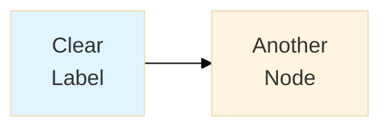

### Stage Progression Example

**Good:**
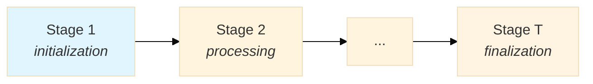

**Why it's good:**
- Clear labels with context
- Styling distinguishes start/end
- Italics for descriptive text
- Clean, horizontal layout

### Cyclic Graphs

**Good:**
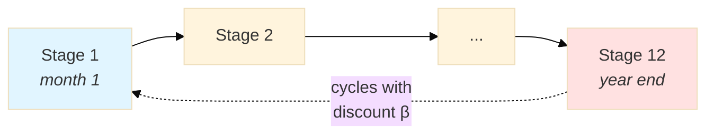

**Features:**
- Dashed line for cycle (`.->`)
- Label on cycle edge
- Different colors for start/cycle point
- Clear temporal context

## Timeline/Gantt Diagrams

**IMPORTANT:** Gantt charts have limitations in Mermaid:
- LaTeX math notation ($...$) doesn't render (shows as literal text)
- Section labels can overlap with content
- Limited styling options

**Better alternative:** Use hierarchical flowcharts with subgraphs for complex temporal relationships.

### Template 4: Hierarchical Temporal Decomposition

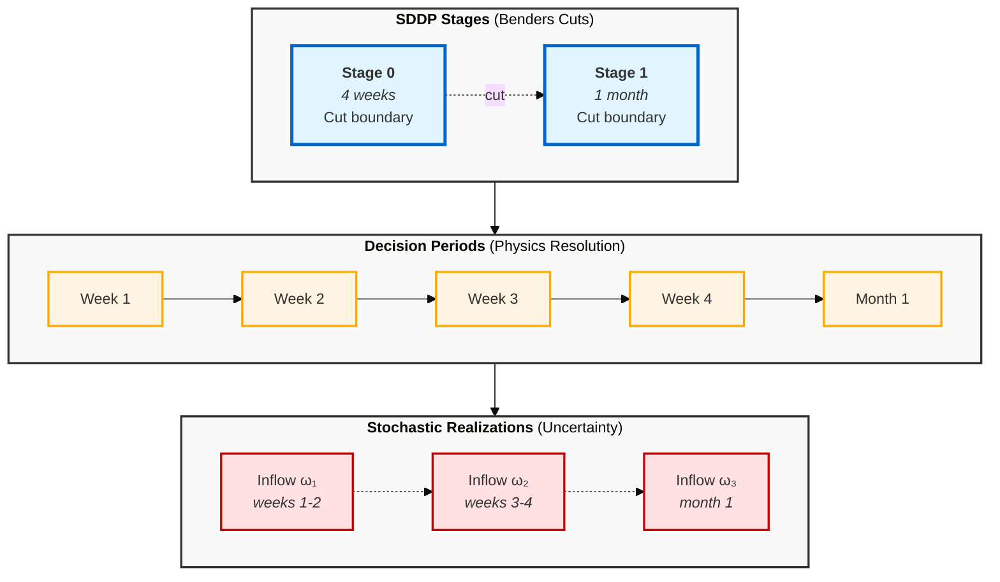

**Key features:**
- Three logical layers (subgraphs) with clear labels
- Unicode Greek letters (ω₁, ω₂) render correctly (unlike $\omega_1$ in Gantt)
- Color coding: blue (stages/cuts), yellow (decisions), red (uncertainty)
- Direction control within subgraphs (`direction LR`)
- Subgraph styling for visual grouping
- Connections between layers show hierarchy

**When to use this:**
- Complex multi-level temporal relationships
- Need to show 3+ different time granularities
- Need mathematical symbols (use Unicode, not LaTeX)
- Gantt chart sections would overlap

## Common Pitfalls

### ❌ Bad: Too Compact

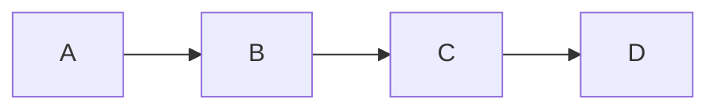

**Problems:**
- No labels
- No styling
- No context
- Hard to distinguish nodes

### ❌ Bad: ASCII Art in Mermaid

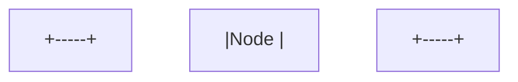

**Problems:**
- Defeats the purpose of Mermaid
- Renders poorly
- Not semantic

### ❌ Bad: Over-styled

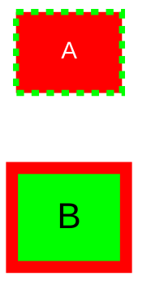

**Problems:**
- Visual noise
- Inconsistent
- Distracting colors

## Mermaid vs ASCII Art

### When to Use Mermaid

✅ **Use Mermaid for:**
- State diagrams
- Flow charts
- Sequence diagrams
- Timeline/Gantt charts
- Any diagram with >3 nodes
- Diagrams needing clear visual hierarchy

### When to Use Text/Lists

✅ **Use formatted text for:**
- Simple algorithms (converted to LaTeX bullets)
- Short lists
- Single linear flows
- Mathematical formulas (use `$$...$$`)

## Complete Example: Converting ASCII to Mermaid

### Before (ASCII)

```
     ┌─────────────────────────────────┐
     │                                 │
     ▼                                 │
Stage 1 ──► Stage 2 ──► ... ──► Stage 12 ─┘
  │                                 │
  └─ year 1, month 1              └─ cycles back with discount
```

###  After (Mermaid)

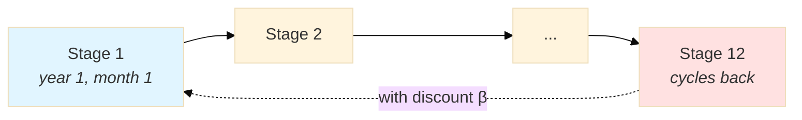

**Improvements:**
- Professional rendering
- Clear labels
- Semantic structure
- PDF-friendly
- Color-coded nodes
- Descriptive edge label

## Style Templates

### Template 1: Linear Progress (SDDP Finite Horizon)

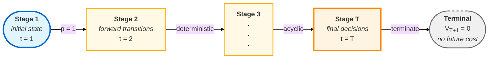

**Key features:**
- Stadium shape `([...])` for start/end nodes
- Bold labels with `<b>...</b>`
- Multiple lines of context
- Edge labels for transition properties
- Gradient coloring from blue (start) to yellow (end)
- Terminal node with dashed border

### Template 2: Branching Flow

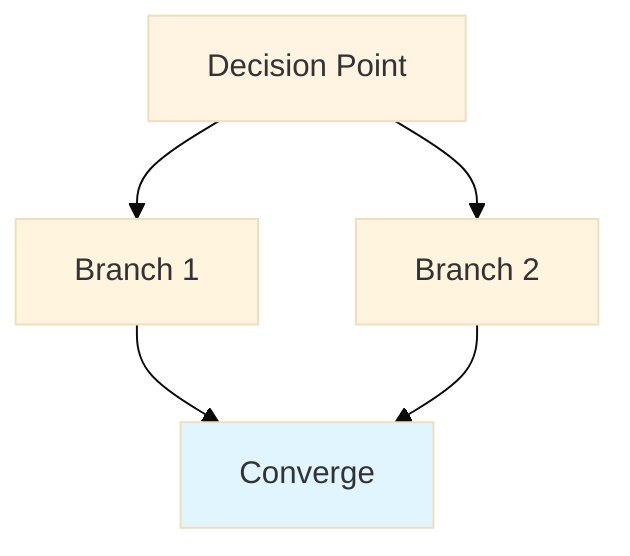

### Template 3: Cycle with Feedback (SDDP Infinite Horizon)

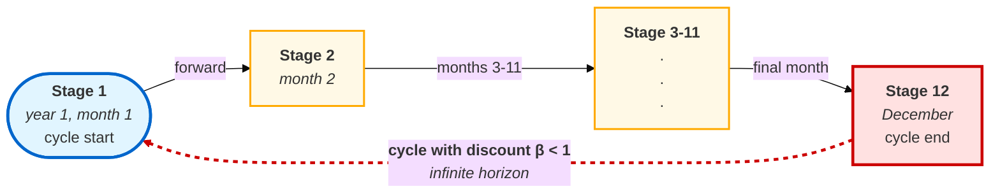

**Key features:**
- Red cycle-end node contrasting with blue start
- Dashed red feedback arrow
- Multi-line edge label with bold/italic formatting
- Stadium shape for cycle endpoints
- Clear temporal progression in labels

## Testing Your Diagrams

### In Markdown Preview
- Use GitHub, VS Code, or Typora preview
- Check that labels are readable
- Verify colors aren't too bold

### In PDF
- Generate test PDF: `make mathematical`
- Check node spacing
- Verify text isn't cut off
- Ensure colors print well in grayscale

## Quick Reference

| Element | Syntax | Use Case |
|---------|--------|----------|
| Solid arrow | `A --> B` | Direct flow |
| Dashed arrow | `A -.-> B` | Cycle/feedback |
| Label on edge | `A -->|"label"| B` | Describe transition |
| Line break in node | `A["Line 1<br/>Line 2"]` | Multi-line labels |
| Italic text | `A["Text<br/><i>italic</i>"]` | Descriptive info |
| Bold text | `A["<b>Text</b>"]` | Emphasis |
| Subscript | `A["V<sub>T+1</sub>"]` | Mathematical notation |
| Stadium shape | `A(["Label"])` | Start/end nodes |
| Rectangle | `A["Label"]` | Regular nodes |
| Style node fill | `style A fill:#e1f5ff` | Background color |
| Style node stroke | `style A stroke:#0066cc,stroke-width:3px` | Border |
| Style link | `linkStyle 0 stroke:#cc0000,stroke-width:3px` | Edge styling |
| Subgraph | `subgraph NAME["Label"]...end` | Group nodes |
| Direction in subgraph | `direction LR` | Control layout |
| Theme init | `%%{init: {'theme':'base', 'themeVariables': {'fontSize':'16px'}}}%%` | PDF rendering |
| Unicode symbols | `ω₁ β α` | Math (NOT $\omega_1$) |

### Color Palette Reference

| Color | Hex | Use Case |
|-------|-----|----------|
| Light blue | `#e1f5ff` | Start nodes, stages |
| Blue border | `#0066cc` | Important borders |
| Light yellow | `#fff9e6` | Intermediate nodes |
| Yellow border | `#ffaa00` | Decision nodes |
| Orange border | `#ff8800` | Final decisions |
| Light red | `#ffe1e1` | Cycle/terminal nodes |
| Red border | `#cc0000` | Cycles, uncertainty |
| Light gray | `#f0f0f0` | Null/terminal states |
| Gray border | `#666666` | Inactive states |
| Subgraph background | `#f9f9f9` | Container styling |
| Subgraph border | `#333333` | Container border |

## Summary

**Good Mermaid diagrams:**
- Have clear, descriptive labels
- Use consistent styling
- Choose appropriate diagram types
- Include context (not just node names)
- Render well in PDF
- Are semantically meaningful

**Avoid:**
- ASCII art in Mermaid
- Over-styling
- Unlabeled nodes
- Overly complex diagrams
- Random colors
