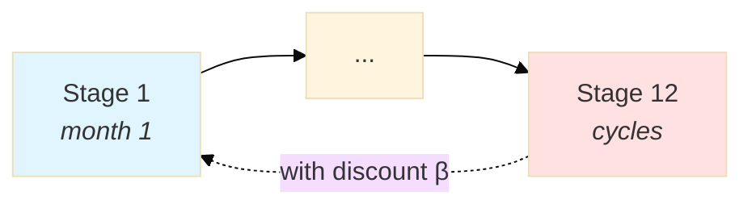

# Markdown to PDF Conversion - Final Workflow

## Overview

This workflow generates **publication-quality PDFs** from markdown with proper mathematical notation and professional diagrams.

## ✅ What Works Now

1. **Algorithms render perfectly** - Mathematical symbols (α, β, ω, θ, etc.) display correctly
2. **Professional diagrams** - Mermaid diagrams with proper styling
3. **No monospace font issues** - Algorithms use LaTeX formatting instead of code blocks
4. **All variables readable** - No more missing or garbled characters

## The Solution

### For Algorithms: Use LaTeX Formatting

Instead of code blocks with Unicode characters, use **LaTeX bullet lists with math mode**:

**Before** (code block - broken in PDF):
````markdown
```
Algorithm: Forward Pass
Input: Initial state x₀, ωₜ ~ P(Ωₜ)
```
````

**After** (LaTeX formatting - perfect in PDF):
```markdown
**Algorithm: Forward Pass** (iteration $k$, pass $m$)

- **Input:** Initial state $x_0$, cut approximations $\{\hat{V}_t^k\}$
- **Output:** Visited states $\{\hat{x}_t^m\}_{t=1}^T$

1. Set $\hat{x}_0 = x_0$
2. For $t = 1$ to $T$:
   - Sample $\omega_t \sim P(\Omega_t)$
   - Solve: $\hat{x}_t = \arg\min \{ c_t^\top x_t + \theta_t : ... \}$
```

### For Diagrams: Use Styled Mermaid

**Before** (ASCII art - hard to read):
```
     ┌────────────┐
     │            │
     ▼            │
Stage 1 ──► Stage 12 ─┘
```

**After** (Mermaid with styling - professional):
````markdown

````

## Quick Start

### Generate PDF

```bash
cd docs
make mathematical
```

### View Result

```bash
evince MATHEMATICAL_FORMULATIONS.pdf &
```

That's it! The PDF will have:
- ✅ Perfect mathematical notation
- ✅ Professional diagrams
- ✅ All symbols readable
- ✅ Publication quality

## Files and Tools

### Configuration Files

**`docs/pandoc-header.tex`**
- LaTeX configuration for Unicode support
- Subscript/superscript definitions via `newunicodechar`
- Table formatting improvements

**`docs/Makefile`**
- Build targets for PDF generation
- Auto-detects mermaid-filter
- Clean and build commands

### Helper Scripts

**`docs/suggest-mermaid-diagrams.py`**
- Identifies ASCII diagrams
- Suggests Mermaid conversions

**`docs/convert-algorithms-to-math.py`**
- Converts algorithm blocks to LaTeX format (if needed)
- Wraps math symbols in `$...$`

### Documentation

**`docs/MERMAID_STYLING_GUIDE.md`**
- Complete guide to creating professional Mermaid diagrams
- Style templates and examples
- Best practices for PDF rendering

**`docs/PDF_WORKFLOW.md`** (this file)
- Complete workflow documentation
- Quick reference

## Requirements

### Essential

```bash
# Fedora/RHEL
sudo dnf install pandoc texlive-xetex texlive-collection-fontsrecommended

# Ubuntu/Debian
sudo apt install pandoc texlive-xetex texlive-fonts-recommended
```

### Optional (for Mermaid diagrams)

```bash
npm install -g mermaid-filter
```

The Makefile auto-detects if mermaid-filter is available.

## Makefile Targets

```bash
make                # Build all PDFs
make mathematical   # Build MATHEMATICAL_FORMULATIONS.pdf
make datamodel      # Build DATA_MODEL_SPECIFICATION.pdf
make clean          # Remove generated PDFs
make help           # Show available targets
```

## Converting Existing Content

### Algorithms

For algorithm pseudocode blocks, convert them to LaTeX formatted lists:

**Steps:**
1. Change code fence (` ``` `) to regular markdown
2. Use **bold** for "Algorithm:" header
3. Use `$...$` for all math symbols
4. Use bullets (`-`) and numbered lists (`1.`)
5. Use `$$...$$` for complex equations

**Example conversion:**

Before:
````markdown
```
For each ω ∈ Ωₜ:
    β(ω) = -πₜ(ω)
```
````

After:
```markdown
For each $\omega \in \Omega_t$:
- $\beta(\omega) = -\pi_t(\omega)$
```

### Diagrams

Use the styling guide in `MERMAID_STYLING_GUIDE.md`.

**Key styling elements:**
- Always use theme init: `%%{init: {'theme':'base', ...}}%%`
- Use colors: `#e1f5ff` (blue), `#fff4e1` (yellow), `#ffe1e1` (red)
- Add context in labels: `["Stage 1<br/><i>description</i>"]`
- Use dashed lines for cycles: `-.->` 
- Label important edges: `-->|"label"|`

## Best Practices

### DO ✅

- **Use LaTeX math mode** (`$...$`) for all mathematical symbols
- **Style Mermaid diagrams** with colors and clear labels
- **Test PDF generation** after major changes
- **Use proper notation** - keep it consistent with prose sections
- **Add context** to diagram labels (not just "Stage 1")

### DON'T ❌

- **Don't use code blocks for algorithms** - they can't render math properly
- **Don't use ASCII art** - convert to Mermaid instead
- **Don't fight monospace fonts** - use LaTeX formatting instead
- **Don't skip styling** - unstyled Mermaid diagrams are hard to read
- **Don't use random colors** - follow the color scheme

## Troubleshooting

### Problem: Missing Characters in Algorithms

**Cause:** Code blocks can't render Greek letters in monospace fonts

**Solution:** Convert to LaTeX formatted lists (see "Converting Existing Content" above)

### Problem: Diagrams Hard to Read

**Cause:** Missing styling, unclear labels

**Solution:** Follow `MERMAID_STYLING_GUIDE.md` - add colors, descriptions, proper layout

### Problem: PDF Generation Fails

**Check:**
```bash
which pandoc
which xelatex
which mermaid-filter  # optional
```

**View errors:**
```bash
make mathematical 2>&1 | less
```

### Problem: Mermaid Not Rendering

**Install:**
```bash
npm install -g mermaid-filter
```

**Verify:**
```bash
which mermaid-filter
```

## Results

### Before This Workflow

- **Algorithms**: Missing symbols (ω → �, α → �)
- **Diagrams**: Basic ASCII art, hard to read
- **PDF Quality**: Unprofessional, broken notation

### After This Workflow

- **Algorithms**: Perfect mathematical notation, all symbols render
- **Diagrams**: Professional Mermaid graphics with styling
- **PDF Quality**: Publication-ready, clear and elegant

## Example: Complete Conversion

### Before

````markdown
```
Algorithm: Forward Pass
Input: x₀, ωₜ ~ P(Ωₜ)
Sample ωₜ
Solve: x̂ₜ = argmin { ... }
```

```
Stage 1 ──► Stage 2 ──► Stage T
```
````

### After

```markdown
**Algorithm: Forward Pass** (iteration $k$)

- **Input:** Initial state $x_0$, scenarios $\omega_t \sim P(\Omega_t)$

1. Sample $\omega_t$
2. Solve: $\hat{x}_t = \arg\min \{ c_t^\top x_t + \theta_t : \ldots \}$

\```mermaid
%%{init: {'theme':'base', 'themeVariables': { 'fontSize':'16px'}}}%%
graph LR
    S1["Stage 1<br/><i>start</i>"]
    S2["Stage 2"]
    ST["Stage T<br/><i>end</i>"]
    
    S1 --> S2 --> ST
    
    style S1 fill:#e1f5ff
    style ST fill:#fff4e1
\```
```

### Result in PDF

- All Greek letters render perfectly (ω, α, β, θ, π, etc.)
- Subscripts and superscripts display correctly
- Diagrams look professional with colors
- Mathematical notation matches the prose sections
- Publication-quality output

## Summary

**The key insight:** Don't try to make monospace fonts render Unicode math. Instead:

1. **Use LaTeX formatting** for algorithms (lists + math mode)
2. **Use styled Mermaid** for diagrams
3. **Keep it simple** - let pandoc and LaTeX do what they're good at

This gives you **professional PDFs** with **perfect mathematical notation** and **beautiful diagrams**.

## Quick Reference Card

| Task | Command |
|------|---------|
| Generate PDF | `make mathematical` |
| Clean PDFs | `make clean` |
| View PDF | `evince MATHEMATICAL_FORMULATIONS.pdf &` |
| Find diagrams | `./suggest-mermaid-diagrams.py FILE.md` |
| Check styling | See `MERMAID_STYLING_GUIDE.md` |

| Notation | Markdown | PDF Result |
|----------|----------|------------|
| Variable with subscript | `$x_0$` | x₀ |
| Greek letter | `$\omega$` | ω |
| Hat notation | `$\hat{x}$` | x̂ |
| Set notation | `$\{x_t\}_{t=1}^T$` | {xₜ}ₜ₌₁ᵀ |
| Optimization | `$\arg\min$` | argmin |
| Inequality | `$\geq$` | ≥ |

**Success!** Your documentation now generates beautiful, professional PDFs! 🎉
